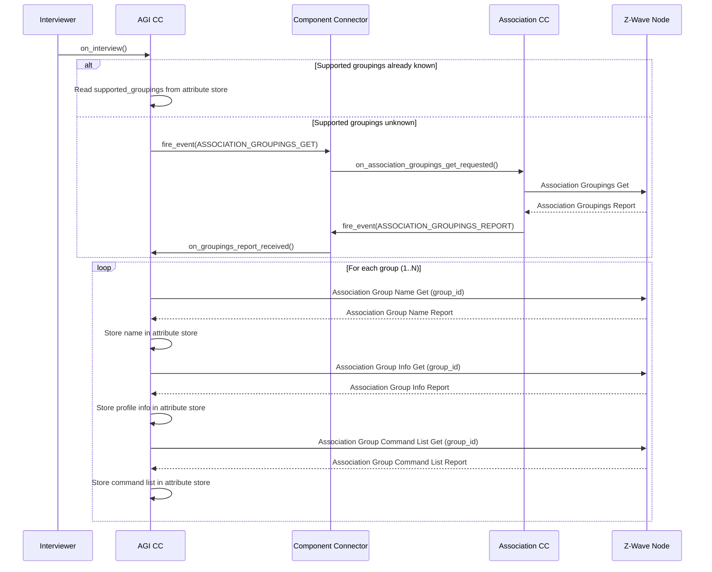

# Association Group Information (AGI) Command Class, Version 3

## Overview

The Association Group Information (AGI) Command Class (0x59) allows a node to advertise
the capabilities of each association group supported by a given application resource.
This implementation supports version 3, which introduces the "Irrigation" profile category.

The AGI CC provides three types of information for each association group:

- **Group Name**: Human-readable name of the association group
- **Group Info**: Profile and event code information for the association group
- **Group Command List**: List of commands that may be sent to members of the association group

## Commands

| Command | Key | Direction | Description |
|---------|-----|-----------|-------------|
| Association Group Name Get | 0x01 | RX (Control) | Request the name of an association group |
| Association Group Name Report | 0x02 | TX (Control) | Report containing the group name |
| Association Group Info Get | 0x03 | RX (Control) | Request profile info of an association group |
| Association Group Info Report | 0x04 | TX (Control) | Report containing group profile and event data |
| Association Group Command List Get | 0x05 | RX (Control) | Request the command list of an association group |
| Association Group Command List Report | 0x06 | TX (Control) | Report containing the supported command list |

## Interview Flow

The AGI CC interview depends on the Association CC's Supported Groupings count.
During the interview, the AGI CC either reads the already-known groupings count from
the attribute store or requests it via the component connector. Once the groupings
count is available, it queries the Name, Info, and Command List for each group.



## MQTT Interface

### Commands

All MQTT commands are published under:

```
zpc/<home_id>/<node_id>/<endpoint_id>/AssociationGrpInfo/Command/<CommandName>
```

#### AssociationGroupNameGet

Request the name of a specific association group.

**Payload:**
```json
{
  "grouping_identifier": "1"
}
```

#### AssociationGroupInfoGet

Request the profile information of a specific association group.

**Payload:**
```json
{
  "grouping_identifier": "1",
  "list_mode": "0",
  "refresh_cache": "0"
}
```

- `list_mode` (optional, default "0"): Set to "1" to request info for all groups
- `refresh_cache` (optional, default "0"): Set to "1" to force a refresh

#### AssociationGroupCommandListGet

Request the command list of a specific association group.

**Payload:**
```json
{
  "grouping_identifier": "1",
  "allow_cache": "0"
}
```

- `allow_cache` (optional, default "0"): Set to "1" to allow cached responses

### Reports

Reports are published under:

```
zpc/<home_id>/<node_id>/<endpoint_id>/AssociationGrpInfo/Report/<ReportName>
```

#### AssociationGroupNameReport

```json
{
  "grouping_identifier": 1,
  "length_of_name": 8,
  "name": [76, 105, 102, 101, 108, 105, 110, 101]
}
```

#### AssociationGroupInfoReport

```json
{
  "group_count": 1,
  "dynamic_info": 0,
  "list_mode": 0,
  "vg1": "complex_type"
}
```

#### AssociationGroupCommandListReport

```json
{
  "grouping_identifier": 1,
  "list_length": 4,
  "command": [32, 1, 38, 3]
}
```

## Component Connector Events

The AGI CC uses the component connector for inter-CC communication:

### Subscribed Events

| Event | Source | Description |
|-------|--------|-------------|
| `COMMAND_CLASS_ASSOCIATION_GROUPINGS_REPORT` | Association CC | Notifies when supported groupings count is available |

### Published Events

| Event | Description |
|-------|-------------|
| `COMMAND_CLASS_ASSOCIATION_GRP_INFO_GROUP_NAME_REPORT` | Fired when a Group Name Report is received |
| `COMMAND_CLASS_ASSOCIATION_GRP_INFO_GROUP_INFO_REPORT` | Fired when a Group Info Report is received |
| `COMMAND_CLASS_ASSOCIATION_GRP_INFO_GROUP_COMMAND_LIST_REPORT` | Fired when a Group Command List Report is received |

## Attribute Store Structure

```
Endpoint Node
├── ASSOCIATION_GROUP_NAME_GET_GROUP
│   └── grouping_identifier
├── ASSOCIATION_GROUP_NAME_REPORT_GROUP
│   ├── grouping_identifier
│   ├── length_of_name
│   └── name
├── ASSOCIATION_GROUP_INFO_GET_GROUP
│   ├── list_mode
│   ├── refresh_cache
│   └── grouping_identifier
├── ASSOCIATION_GROUP_INFO_REPORT_GROUP
│   ├── group_count
│   ├── dynamic_info
│   ├── list_mode
│   └── vg1 (serialized variant group data)
├── ASSOCIATION_GROUP_COMMAND_LIST_GET_GROUP
│   ├── allow_cache
│   └── grouping_identifier
└── ASSOCIATION_GROUP_COMMAND_LIST_REPORT_GROUP
    ├── grouping_identifier
    ├── list_length
    └── command
```
