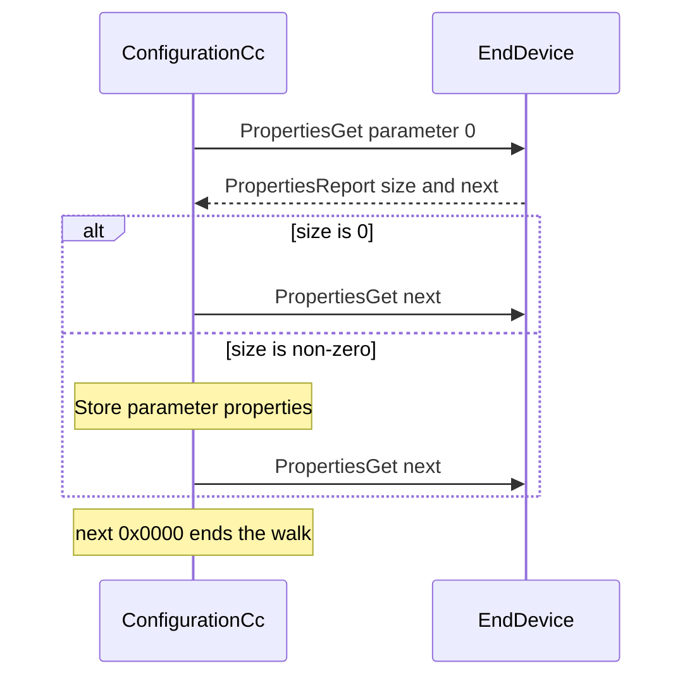

# Configuration Command Class (version 4)

Command Class ID: `0x70` (112 decimal)

## Overview

Control-only implementation. ZPC sends Configuration commands to end devices and stores parameter records. It does not answer Configuration commands as a supporting node.

Interview sends no Configuration traffic. The specification requires none for a controlling node. Discovery and value access are on-demand MQTT commands.

## Supported Commands

| Command | ID | Direction | Notes |
|---|---|---|---|
| Configuration Set | 0x04 | TX | Parameter numbers 1-255 |
| Configuration Get | 0x05 | TX | Parameter numbers 1-255 |
| Configuration Report | 0x06 | RX | |
| Configuration Name Get | 0x0A | TX | 16-bit parameter number |
| Configuration Name Report | 0x0B | RX | UTF-8 fragments until Reports to Follow is 0 |
| Configuration Info Get | 0x0C | TX | 16-bit parameter number |
| Configuration Info Report | 0x0D | RX | UTF-8 fragments until Reports to Follow is 0 |
| Configuration Properties Get | 0x0E | TX | 16-bit parameter number |
| Configuration Properties Report | 0x0F | RX | |
| Configuration Default Reset | 0x01 | TX | Version 4 |
| Configuration Bulk Get/Set/Report | 0x07-0x09 | - | Generated but not transmitted |

## Interview

`on_interview` sends no frames for any version.

## On-demand Properties Walk (version 3+)

MQTT command: `ConfigurationPropertiesDiscover`



## On-demand Version 1-2 Parameter Scan

MQTT command: `ConfigurationParameterScan`

Recommended probe from CC:0070.01.00.22.001. For each parameter number 1 through 255, try sizes 1, 2, and 4 with a Configuration Set of value 0 followed by Configuration Get. Resolver give-up advances to the next size or parameter. This scan writes 0 into every parameter it finds.

If two or more parameters were found and the node is version 1–3, the scan continues with the default-bit probe and may set `default_resets_every_parameter`. Version 4 nodes skip that probe.

## Attribute Store Structure

```
Endpoint Node
├── discovery_complete
├── default_resets_every_parameter
├── properties_walk_active
├── parameter_scan_active
├── PARAMETER_ID (keyed by parameter number)
│   ├── size
│   ├── format
│   ├── min_value
│   ├── max_value
│   ├── default_value
│   ├── value
│   ├── name
│   ├── info
│   ├── read_only
│   ├── altering_capabilities
│   ├── advanced
│   └── no_bulk_support
├── CONFIGURATION_GET_GROUP
├── CONFIGURATION_SET_GROUP
├── CONFIGURATION_PROPERTIES_GET_GROUP
└── ...
```

## MQTT Commands

| Command | Purpose |
|---|---|
| ConfigurationGet | Read one parameter (1-255) |
| ConfigurationSet | Write one parameter; payload `parameter_number`, optional `size`, `value`, optional `default_flag` |
| ConfigurationNameGet | Read parameter name |
| ConfigurationInfoGet | Read parameter info |
| ConfigurationPropertiesGet | Read one parameter's properties |
| ConfigurationPropertiesDiscover | Walk all parameters via Properties Get |
| ConfigurationParameterScan | Version 1-2 size scan |
| ConfigurationDefaultReset | Reset all parameters (version 4) |
