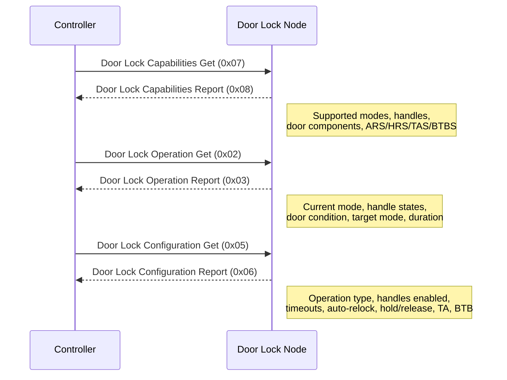

# Door Lock Command Class (version 4)

Command Class ID: `0x62` (98 decimal)

## Overview

The Door Lock Command Class version 4 provides control of door lock devices. This implementation supports **control mode only**, meaning it acts as a controlling node that sends commands to supporting door lock nodes.

Version 4 is backwards compatible with versions 1-3 and adds:
- Door Lock Capabilities Get/Report commands
- Auto-relock, twist assist, hold-and-release, and block-to-block configuration fields

## Supported Commands

| Command | ID | Direction | Description |
|---|---|---|---|
| Door Lock Operation Set | 0x01 | TX | Set the lock mode |
| Door Lock Operation Get | 0x02 | TX | Query current lock state |
| Door Lock Operation Report | 0x03 | RX | Receives current lock state |
| Door Lock Configuration Set | 0x04 | TX | Set lock configuration |
| Door Lock Configuration Get | 0x05 | TX | Query lock configuration |
| Door Lock Configuration Report | 0x06 | RX | Receives lock configuration |
| Door Lock Capabilities Get | 0x07 | TX | Query device capabilities |
| Door Lock Capabilities Report | 0x08 | RX | Receives device capabilities |

## Interview Sequence

During the interview process, the controller queries the door lock node for its capabilities, current operation state, and configuration.



## Door Lock Modes

| Value | Description | Operation Type |
|---|---|---|
| 0x00 | Door Unsecured | Constant |
| 0x01 | Door Unsecured with timeout | Timed |
| 0x10 | Door Unsecured for inside Door Handles | Constant |
| 0x11 | Door Unsecured for inside Door Handles with timeout | Timed |
| 0x20 | Door Unsecured for outside Door Handles | Constant |
| 0x21 | Door Unsecured for outside Door Handles with timeout | Timed |
| 0xFE | Door mode unknown | N/A |
| 0xFF | Door Secured | Constant |

## Attribute Store Structure

```
Endpoint Node
├── DOOR_LOCK_CAPABILITIES_GET_GROUP
├── DOOR_LOCK_CAPABILITIES_REPORT_GROUP
│   ├── supported_operation_type_bit_mask_length
│   ├── supported_operation_type_bit_mask
│   ├── supported_door_lock_mode_list_length
│   ├── supported_door_lock_mode
│   ├── supported_inside_handle_modes_bitmask
│   ├── supported_outside_handle_modes_bitmask
│   ├── supported_door_components
│   ├── btbs
│   ├── tas
│   ├── hrs
│   └── ars
├── DOOR_LOCK_OPERATION_GET_GROUP
├── DOOR_LOCK_OPERATION_REPORT_GROUP
│   ├── current_door_lock_mode
│   ├── inside_door_handles_mode
│   ├── outside_door_handles_mode
│   ├── door_condition
│   ├── remaining_lock_time_minutes
│   ├── remaining_lock_time_seconds
│   ├── target_door_lock_mode
│   └── duration
├── DOOR_LOCK_OPERATION_SET_GROUP
│   └── door_lock_mode
├── DOOR_LOCK_CONFIGURATION_GET_GROUP
├── DOOR_LOCK_CONFIGURATION_REPORT_GROUP
│   ├── operation_type
│   ├── inside_door_handles_enabled
│   ├── outside_door_handles_enabled
│   ├── lock_timeout_minutes
│   ├── lock_timeout_seconds
│   ├── auto_relock_time
│   ├── hold_and_release_time
│   ├── ta
│   └── btb
└── DOOR_LOCK_CONFIGURATION_SET_GROUP
    ├── operation_type
    ├── inside_door_handles_enabled
    ├── outside_door_handles_enabled
    ├── lock_timeout_minutes
    ├── lock_timeout_seconds
    ├── auto_relock_time
    ├── hold_and_release_time
    ├── ta
    └── btb
```
