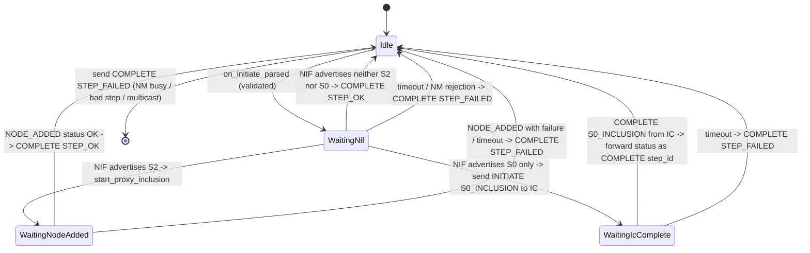
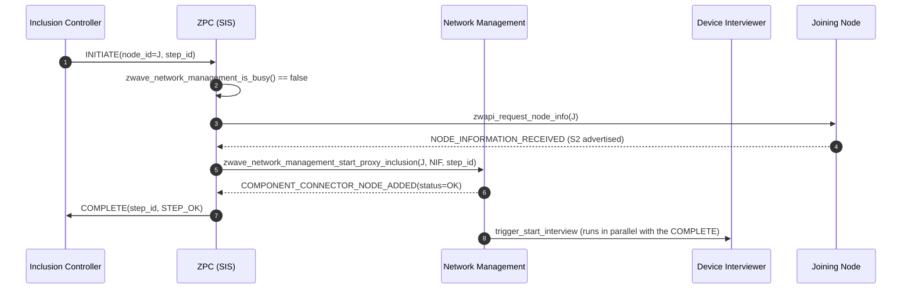
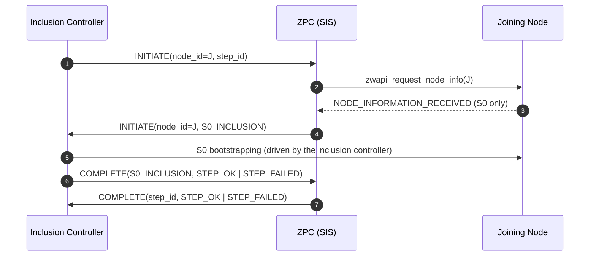

# Inclusion Controller Command Class (0x74)

This Command Class is used after a new node has been included in the network so
that the inclusion controller and the SIS can negotiate which one performs the
remaining setup steps (e.g. S2 bootstrapping, optional probing).

## Spec

- v1 specification: `html/_sources/network_protocol_command_classes/command_class_definitions/inclusion_controller_command_class_version_1.rst.txt`
- Frame definitions: `ZW_classcmd.h` (search for `INITIATE_PROXY_INCLUSION` / `COMPLETE_STEP_OK`).

ZPC always plays the **SIS** role here. After receiving `INITIATE` from a
non-SIS inclusion controller it requests the joining node's NIF and then
branches based on the joining node's security capabilities
(CC:0074.01.01.11.005):

- **S2 (`COMMAND_CLASS_SECURITY_2`, 0x9F)**: ZPC drives the existing
  proxy-inclusion path through Network Management itself. After
  `NODE_ADDED` it replies `COMPLETE STEP_OK` at the highest common Security
  Class.
- **S0 only (`COMMAND_CLASS_SECURITY`, 0x98 without 0x9F)**: ZPC must NOT
  perform S0 itself. It delegates S0 bootstrapping back to the inclusion
  controller by sending `INITIATE (Step ID = S0_INCLUSION)` and waits for
  the controller's `COMPLETE (Step ID = S0_INCLUSION)`. The status of that
  reply is forwarded to the original `INITIATE` (`STEP_OK` if the
  controller reported `STEP_OK`, otherwise `STEP_FAILED`).
- **Neither**: nothing to bootstrap, ZPC replies `COMPLETE STEP_OK`
  immediately.

The deeper attribute-store interview run by the device interviewer corresponds
to the spec's step 10 ("SHOULD perform any probing"). It runs in parallel with
sending the `COMPLETE` and is not allowed to delay it: the inclusion controller
applies its own timeout for receiving `COMPLETE` after S2 bootstrapping
(CC:0074.01.02.11.001). The mandatory "device probe" referenced by
CC:0074.01.02.11.004 is satisfied by the NIF request that the proxy-inclusion
path itself performs (spec step 3).

The only `INITIATE` ZPC sends is the S0 delegation above; the only `COMPLETE`
it accepts is the matching reply from the inclusion controller. Any other
incoming `COMPLETE` (no session, wrong sender, wrong step) is logged and
ignored.

## State machine

A single in-flight session is tracked. While a session is active, additional
`INITIATE` frames are answered with `COMPLETE STEP_FAILED` instead of being
queued.

Each state transition arms a 60-second backstop timer; if it fires the SIS
gives up and replies `STEP_FAILED`.

## Frame flow

### S2-capable joining node (proxy inclusion driven by ZPC)

### S0-only joining node (S0 inclusion delegated back to the controller)

If any step fails, ZPC sends `COMPLETE(step_id, STEP_FAILED)` to the inclusion
controller and clears the session so a fresh `INITIATE` can be accepted.

## Why this does not interfere with existing flows

- **Inclusion sequences**: ZPC checks `zwave_network_management_is_busy()`
  before requesting the NIF, and `zwave_network_management_start_proxy_inclusion`
  itself rejects when Network Management is not idle. The S0-delegation branch
  does not call into Network Management at all, so it cannot interfere with an
  in-flight inclusion sequence.
- **Device interviewer**: the proxy-inclusion path inside Network Management
  fires the same `COMPONENT_CONNECTOR_NODE_ADDED` event the regular add path
  does, so the device interviewer runs without modification. The Inclusion
  Controller CC does not wait for the interview to finish before sending
  `COMPLETE`; the spec's mandatory "device probe" (CC:0074.01.02.11.004) is
  satisfied by the NIF request the proxy-inclusion path already performs.
- **Security**: the highest-common-Security-Class requirement
  (CC:0074.01.01.11.005 / CC:0074.01.02.11.002) is enforced for incoming frames
  by `zwave_security_validation_is_security_valid_for_control` and for the
  outbound `COMPLETE` by `zwave_tx_scheme_get_node_connection_info`.

## Handoff arbitration: deferred interview request

When another controller assigns a NodeID, the Z-Wave protocol creates the AS
placeholder before any `INITIATE` reaches us. We don't yet know whether the
originating controller is an Inclusion Controller about to hand off via this CC,
or a peer that simply included the node and won't talk to us further.

This CC arbitrates between the two:

1. `system_events` fires `COMPONENT_CONNECTOR_NODE_ID_ASSIGNED_BY_OTHER_CONTROLLER`.
2. This CC arms a short grace timer (`HANDOFF_GRACE_MS`, 5 s).
3. If `INITIATE` arrives for that NodeID within the grace, the timer is cancelled
   and the proxy / S0 path takes over. Network Management eventually fires the
   real `NODE_ADDED` (with proper granted keys), which the device interviewer
   consumes as usual.
4. If the timer expires without an `INITIATE`, this CC fires
   `COMPONENT_CONNECTOR_NODE_INTERVIEW_REQUESTED`, which the device interviewer
   consumes to start a probe of the node directly.
5. `NODE_DELETED` for the node also cancels the grace timer.

Only one such arbitration is in flight at any time on a Z-Wave network. The
device interviewer carries no timer or handoff knowledge: it simply listens to
`NODE_ADDED` and `NODE_INTERVIEW_REQUESTED`.
