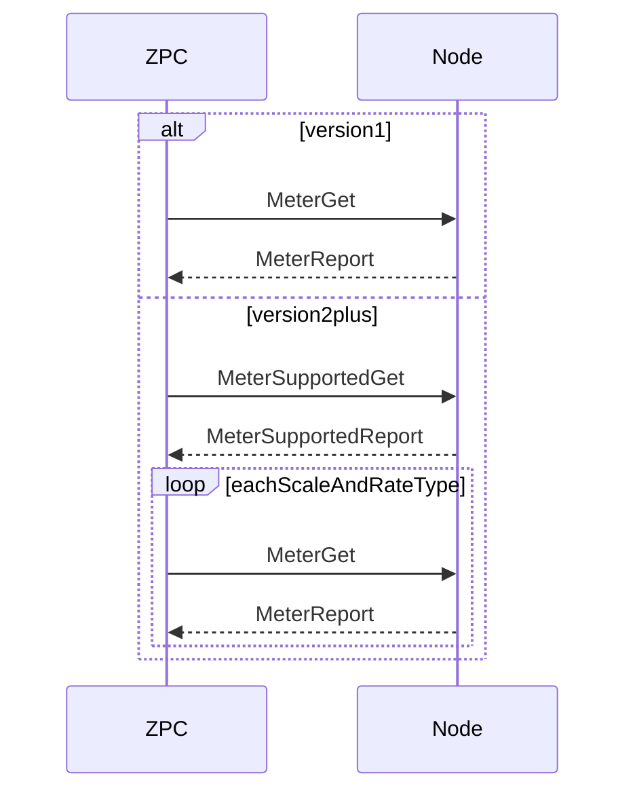

# Meter Command Class

ZPC controls Meter Command Class version 1–6. It interviews supporting nodes, publishes meter readings on MQTT, and can send Meter Reset when the node advertises reset support.

## Configuration

| Field | Value |
| --- | --- |
| Command Class | `COMMAND_CLASS_METER` (0x32) |
| Version | 6 |
| Control | true |
| Support | false |
| MQTT | true |

## Interview

Interview does not close itself. It uses `cc_interview_require_attribute` and `start_group_resolution`.

### Version 1

1. Create one Meter Report group and require `meter_value`.
2. Send Meter Get with no parameters.
3. Store and publish the Meter Report.

### Version 2 and newer

1. Require Meter Supported Report fields (`meter_type`, `meter_reset`, `scale_supported_0`).
2. Send Meter Supported Get.
3. From the supported scales (and rate types on version 4+), create a Meter Report group per reading and require each `meter_value`.
4. Send Meter Get for each reading until every required value is reported.



## MQTT commands

Generated report topics publish Meter Supported Report and Meter Report status.

### MeterSupportedGet

Topic: `zpc/<home_id>/<node_id>/ep<endpoint_id>/Meter/Command/MeterSupportedGet`

Requires node version 2 or newer. Empty payload.

### MeterGet

Topic: `zpc/<home_id>/<node_id>/ep<endpoint_id>/Meter/Command/MeterGet`

Version 1: empty payload.

Version 2+:

```json
{
  "scale": 0,
  "rate_type": 1
}
```

`rate_type` is required for version 4+ (`1` Import, `2` Export). `scale` is the logical scale from the Meter scale table (`0`–`8`).

### MeterReset

Topic: `zpc/<home_id>/<node_id>/ep<endpoint_id>/Meter/Command/MeterReset`

Refused when version is below 2 or Meter Supported Report did not advertise reset.

Version 2–5: empty payload. Sends Meter Reset with no fields.

Version 6:

```json
{
  "meter_type": 1,
  "rate_type": 1,
  "scale": 0,
  "precision": 2,
  "meter_value": [0, 0, 0, 0]
}
```

`meter_value` length is the Size field (1–4 bytes).

## Out of scope

- Acting as a Meter supporting node
- Meter Table / Pulse Meter command classes
- Periodic 6-hour listening-node probe and Wake Up Notification re-read
