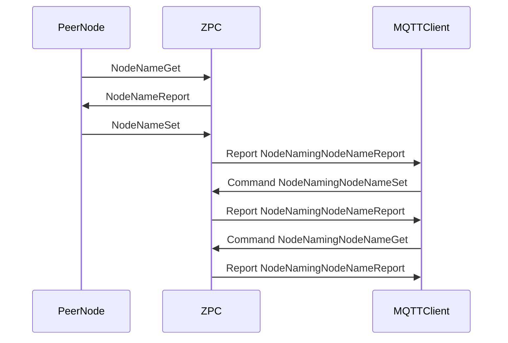

# COMMAND_CLASS_NODE_NAMING

ZPC supports Node Naming and Location (`0x77`, version 1) on itself. It stores a
node name and location, answers Name/Location Get with Reports, accepts
Name/Location Set, and exposes the same values over MQTT. It does not control
Node Naming on other nodes.

Character presentation values `0` (standard ASCII), `1` (extended ASCII), and
`2` (UTF-16) are accepted. Character fields are at most 16 bytes and are stored
as received without transcoding. Missing values report empty characters and
presentation `0`.

## Sequence

