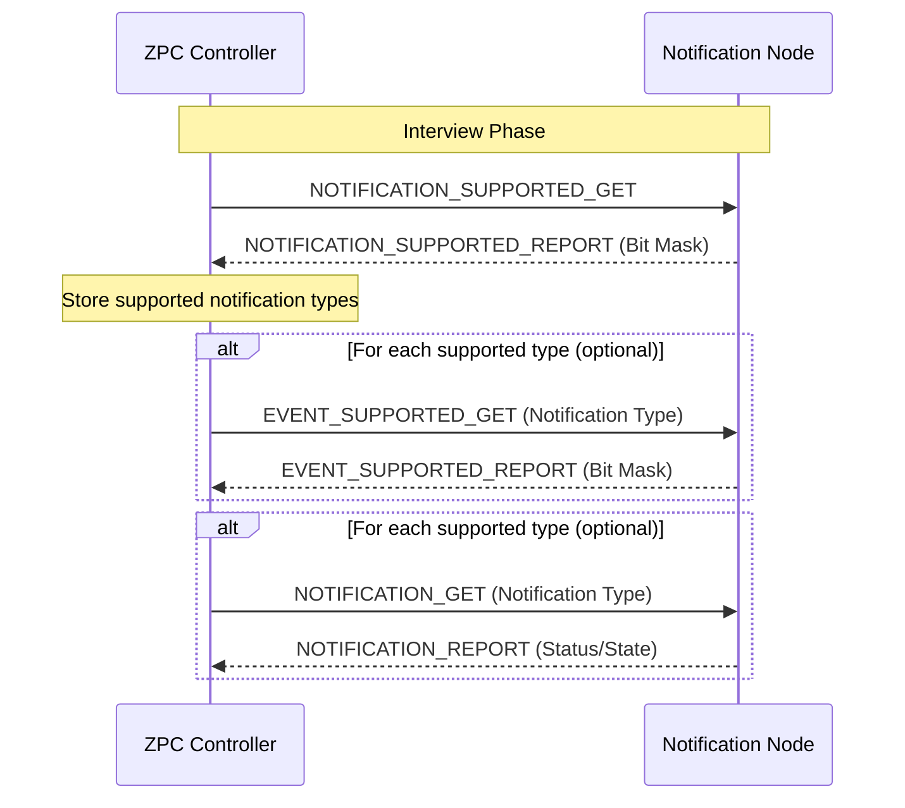
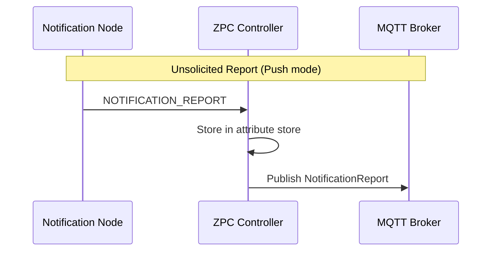

# Notification Command Class (Version 8)

This document describes the Notification Command Class implementation for the ZPC controller. The ZPC acts as a controlling node receiving Notification Reports from sensor devices (Push/Pull nodes).

## Specification Reference

- Z-Wave Application Specification: Notification Command Class, version 3-8
- Interview flow: See Figure 6.14 in Command Class Control definitions

## Interview Flow

The Notification CC interview follows the specification flow:

1. Notification Supported Get (no parameters)
2. Device responds with Notification Supported Report (supported types bit mask)
3. For each supported Notification Type, Event Supported Get (with Notification Type parameter) may be issued
4. For each supported Notification Type, Notification Get may be issued to read current status

The initial implementation triggers step 1 during interview. Chained Event Supported Get and per-type Notification Get can be added incrementally.

## Sequence Diagram: Notification CC Interview

## Sequence Diagram: Receiving Notification Report

## MQTT Interface

See [command_class_notification_mqtt_interface.md](generated/command_class_notification_mqtt_interface.md) for the complete MQTT API documentation.
