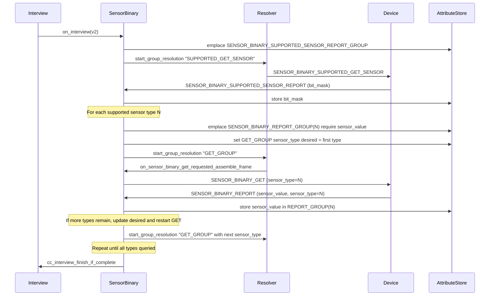
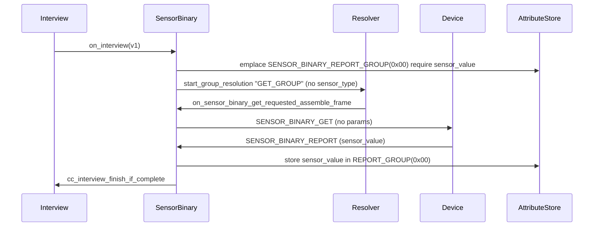
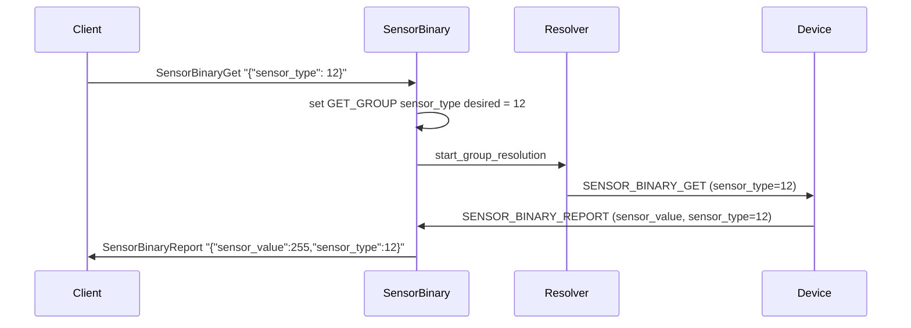

# Binary Sensor Command Class

Binary Sensor CC (0x30, version 2, DEPRECATED) — ZPC controls binary sensor devices
(motion, door/window, smoke, etc.) on the Z-Wave network. ZPC does not act as a sensor.

The spec recommends Notification CC (v3+) for new implementations, but Binary Sensor is
still present in deployed devices and must be controlled.

## Interview Flow — Version 2

Version 2 adds a supported-sensor-type discovery step before querying individual types.

## Interview Flow — Version 1

Version 1 has no sensor type; a single GET is sent and the response is stored under
sensor_type = 0x00 (sentinel).

## MQTT Command Flow — SensorBinaryGet

