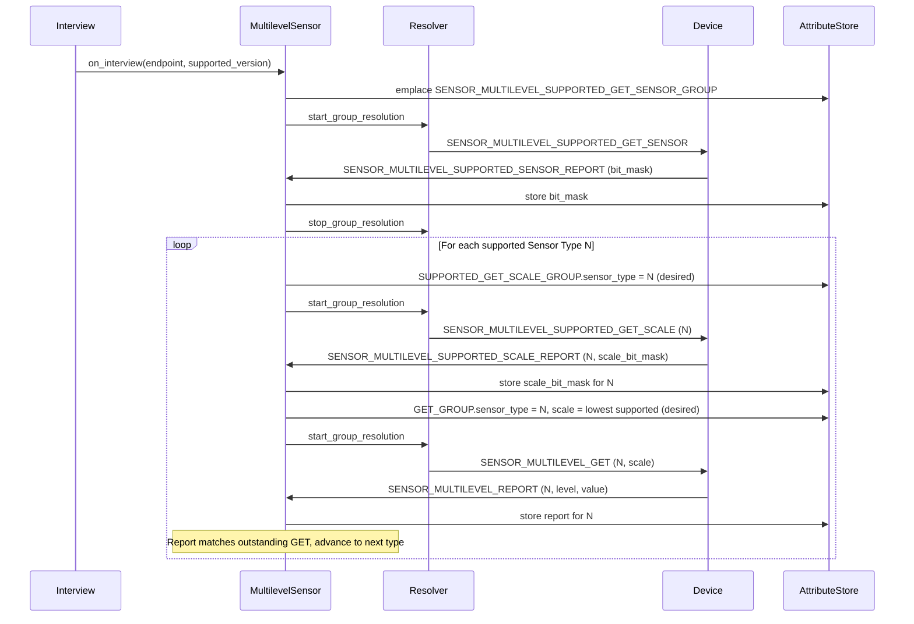
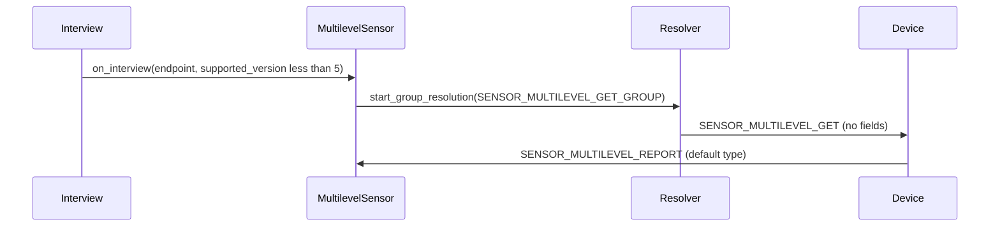
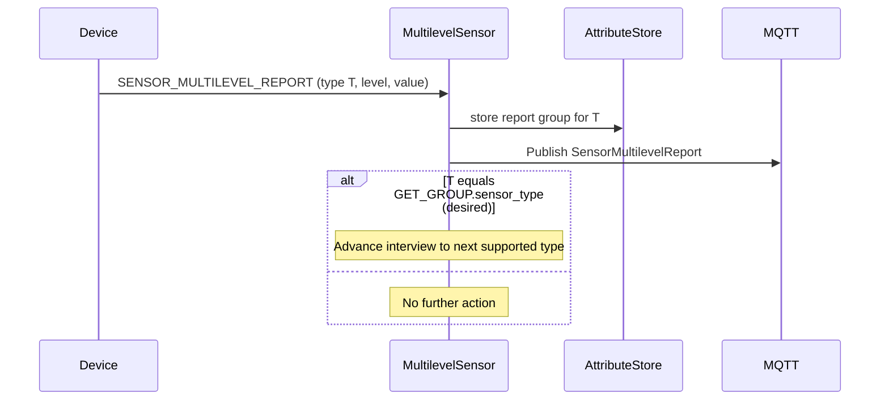
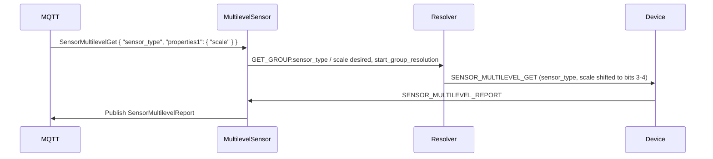

# Multilevel Sensor Command Class - Sequence Diagrams

This document describes the communication flows for the Multilevel Sensor command class (version 11, controlled only).

The MQTT interface is documented in [generated/command_class_sensor_multilevel_mqtt_interface.md](generated/command_class_sensor_multilevel_mqtt_interface.md).

## Attribute Store Layout

Each reported Sensor Type gets its own `SENSOR_MULTILEVEL_REPORT_GROUP` and `SENSOR_MULTILEVEL_SUPPORTED_SCALE_REPORT_GROUP`, keyed by the reported `sensor_type`. The GET groups are single and carry the outstanding request as desired values.

```text
Endpoint Node
├── SENSOR_MULTILEVEL_SUPPORTED_GET_SENSOR_GROUP
├── SENSOR_MULTILEVEL_SUPPORTED_SENSOR_REPORT_GROUP
│   └── bit_mask                       (bit 0 of byte 1 = Sensor Type 0x01)
├── SENSOR_MULTILEVEL_SUPPORTED_GET_SCALE_GROUP
│   └── sensor_type                    (desired)
├── SENSOR_MULTILEVEL_SUPPORTED_SCALE_REPORT_GROUP   (one per Sensor Type)
│   ├── sensor_type
│   └── scale_bit_mask                 (4 bits, bit n = scale n supported)
├── SENSOR_MULTILEVEL_GET_GROUP
│   ├── sensor_type                    (desired)
│   └── scale                          (desired)
└── SENSOR_MULTILEVEL_REPORT_GROUP                   (one per Sensor Type)
    ├── sensor_type
    ├── size                           (1, 2 or 4)
    ├── scale                          (decoded, 0..3)
    ├── precision                      (decoded, 0..7)
    └── sensor_value                   (big-endian signed, `size` bytes)
```

## Interview Flow (version 5 and newer)

The interview walks the supported Sensor Types sequentially. For each type the supported scales are queried first, then a reading is requested using the lowest supported scale. It stays open until the supported-type bitmask is stored, and until each scale mask and sensor value requested along the way is stored.



## Interview Flow (versions 1 to 4)

Older nodes have no Supported Get commands and the Get command carries no fields. The node answers with its default Sensor Type. The interview stays open until that report's sensor value is stored. Any report completes the Get.



## Unsolicited Reports

Sensors typically push readings over the Lifeline. Such reports are stored and published to MQTT. They advance the interview only when their Sensor Type matches the outstanding GET.



## Get Reading Flow (via MQTT)



## Notes

- `scale` and `precision` in the `SensorMultilevelReport` MQTT payload are the raw masked bits of the Level byte as produced by the generated parser (scale in bits 3-4, precision in bits 5-7). The attribute store holds the decoded values. `SensorMultilevelGet` accepts the decoded values.
- Sensor Type and Scale names are not resolved; the numeric identifiers from the Z-Wave registry are published as-is (CC:0031.05.05.11.00A).
