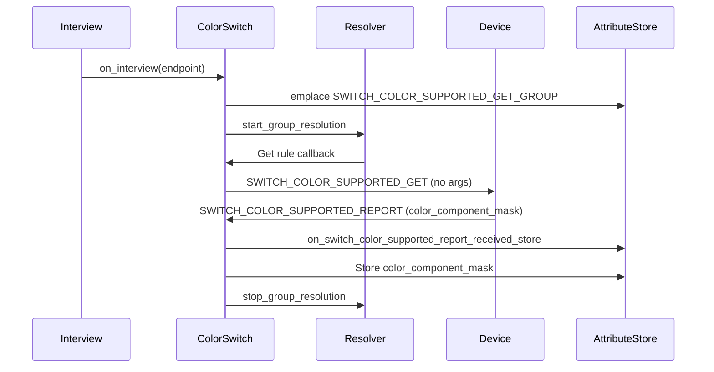
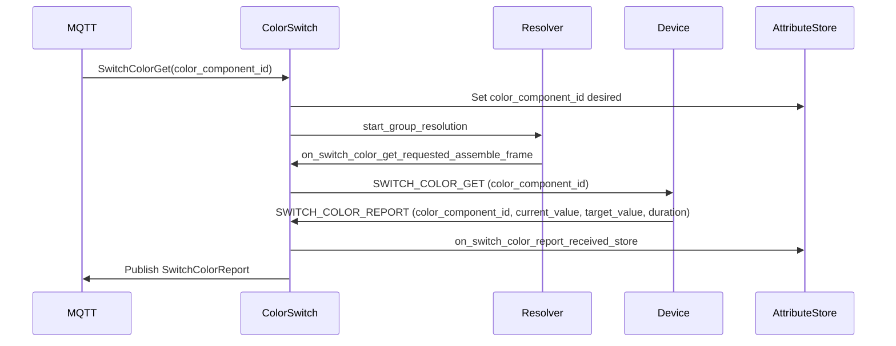
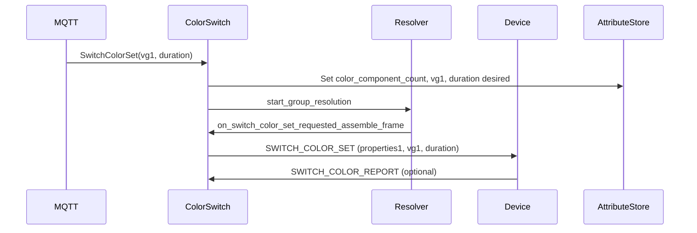
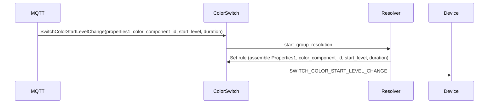
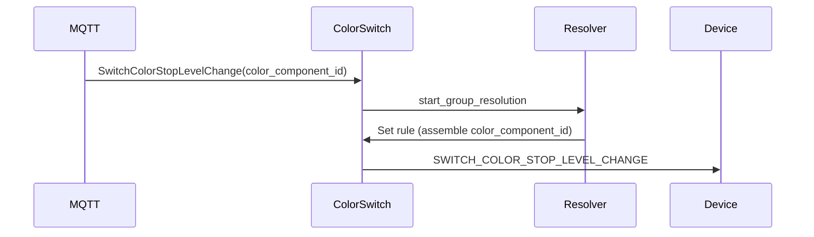

# Color Switch Command Class - Sequence Diagrams

This document describes the communication flows for the Color Switch command class (version 3).

## Interview Flow - Supported Colors Query

## Get Color Value Flow

## Set Color Flow

## Start Level Change Flow

## Stop Level Change Flow

## Color Component IDs (from Z-Wave specification)

| ID | Label                    | Value Range |
|----|--------------------------|-------------|
| 0  | Warm White               | 0x00..0xFF  |
| 1  | Cold White               | 0x00..0xFF  |
| 2  | Red                      | 0x00..0xFF  |
| 3  | Green                    | 0x00..0xFF  |
| 4  | Blue                     | 0x00..0xFF  |
| 5  | Amber (6ch color mixing) | 0x00..0xFF  |
| 6  | Cyan (6ch color mixing)  | 0x00..0xFF  |
| 7  | Purple (6ch color mixing)| 0x00..0xFF  |
| 8  | Indexed Color [OBSOLETED]| 0x00..0xFF  |

## Dependencies

Nodes supporting Color Switch Command Class must support one of:
- Multilevel Switch Command Class, version 4
- Binary Switch Command Class, version 2

Color component levels are scaled by the brightness level set via Multilevel Switch or Basic Set.
