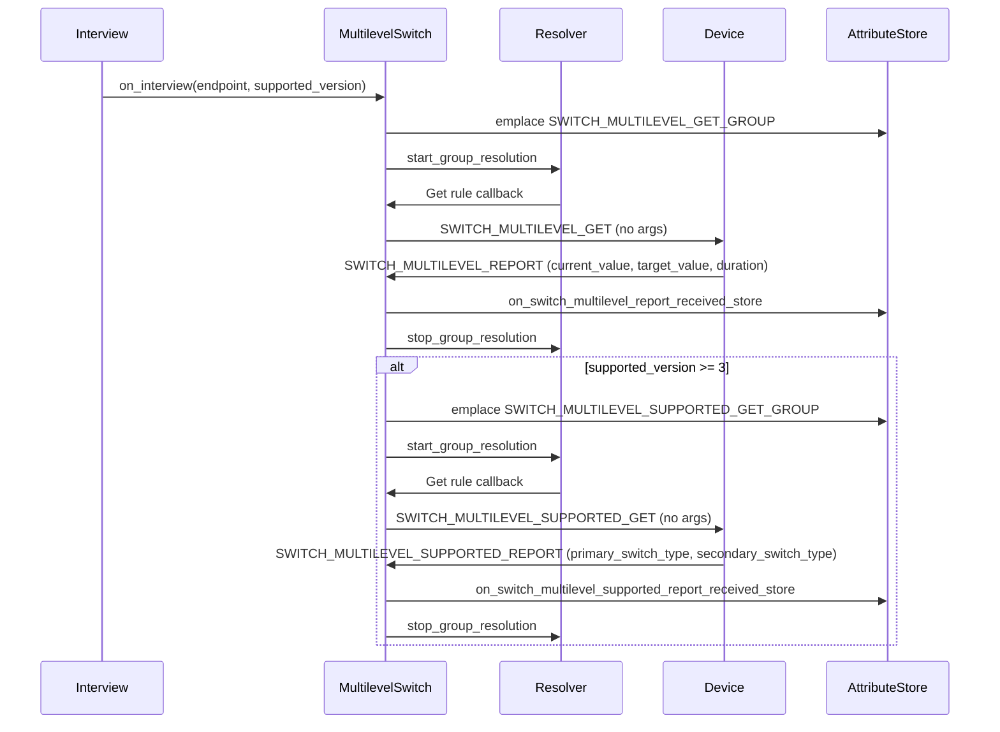
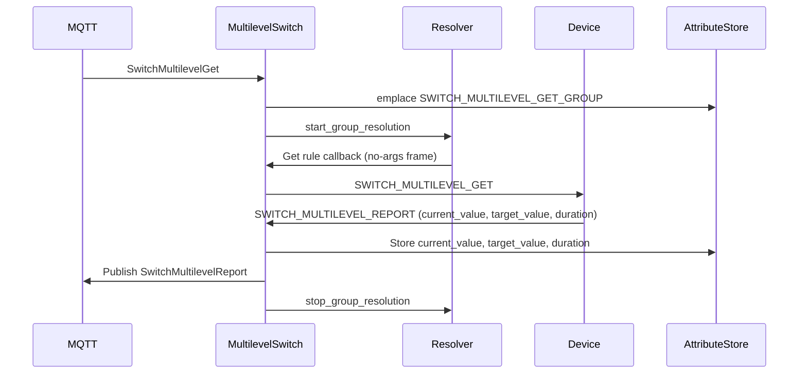
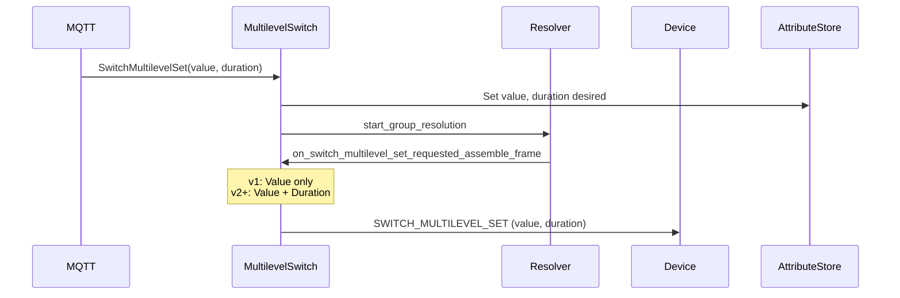
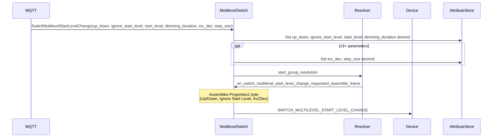
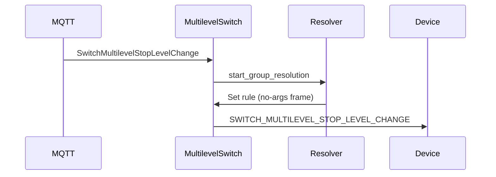
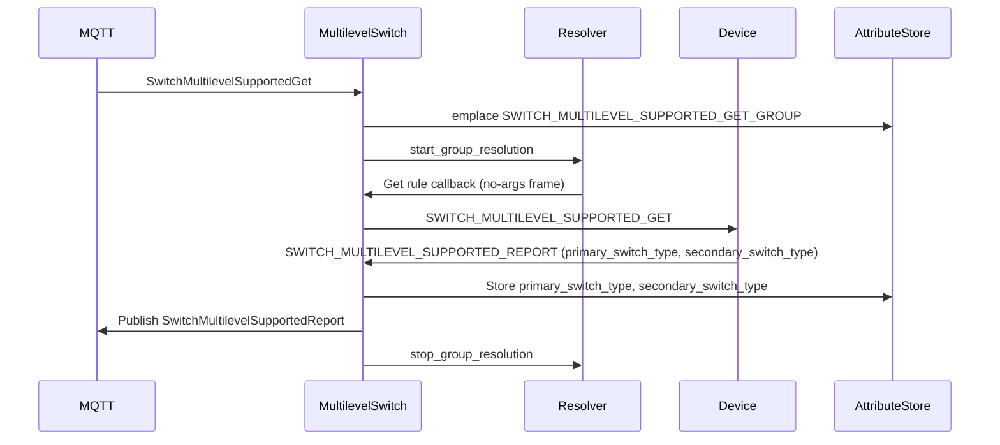

# Multilevel Switch Command Class - Sequence Diagrams

This document describes the communication flows for the Multilevel Switch command class (version 4).

## Interview Flow



## Get Current Value Flow



## Set Value Flow



## Start Level Change Flow



## Stop Level Change Flow



## Supported Get/Report Flow



## Switch Types (from Z-Wave specification)

| Value | Type             | Direction A (0x00)  | Direction B (0x63/0xFF) |
|-------|------------------|---------------------|-------------------------|
| 0x00  | Undefined        | -                   | -                       |
| 0x01  | On/Off           | Off                 | On                      |
| 0x02  | Up/Down          | Down                | Up                      |
| 0x03  | Open/Close       | Close               | Open                    |
| 0x04  | CCW/CW           | Counter-Clockwise   | Clockwise               |
| 0x05  | Left/Right       | Left                | Right                   |
| 0x06  | Reverse/Forward  | Reverse             | Forward                 |
| 0x07  | Pull/Push        | Pull                | Push                    |

## Attribute Store Tree

```
Endpoint Node
├── SWITCH_MULTILEVEL_GET_GROUP
├── SWITCH_MULTILEVEL_SET_GROUP
│   ├── value
│   └── duration
├── SWITCH_MULTILEVEL_REPORT_GROUP
│   ├── current_value
│   ├── target_value
│   └── duration
├── SWITCH_MULTILEVEL_START_LEVEL_CHANGE_GROUP
│   ├── up_down
│   ├── ignore_start_level
│   ├── inc_dec
│   ├── start_level
│   ├── dimming_duration
│   └── step_size
├── SWITCH_MULTILEVEL_STOP_LEVEL_CHANGE_GROUP
├── SWITCH_MULTILEVEL_SUPPORTED_GET_GROUP
└── SWITCH_MULTILEVEL_SUPPORTED_REPORT_GROUP
    ├── primary_switch_type
    └── secondary_switch_type
```
