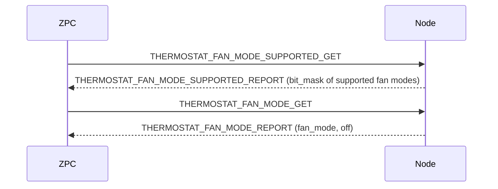
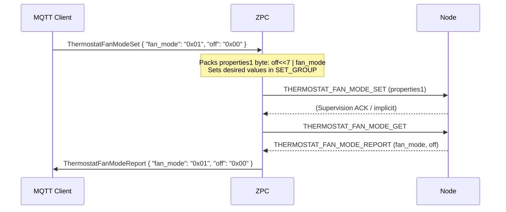
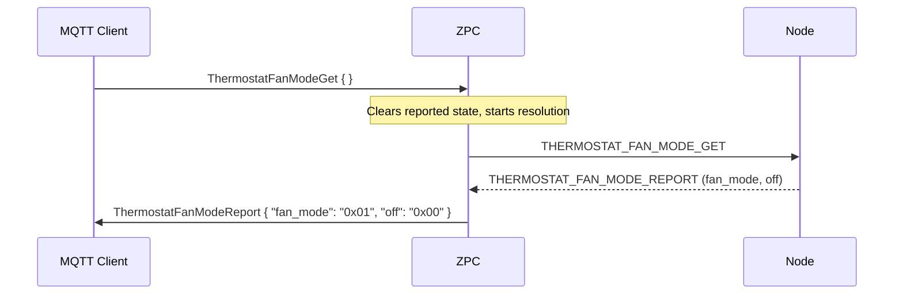
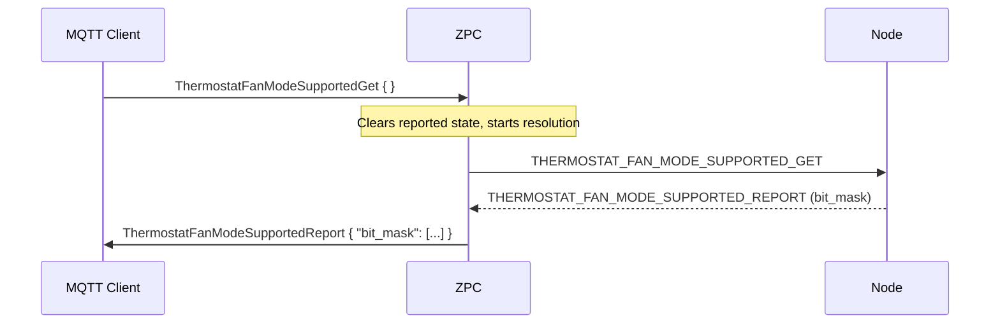

# Thermostat Fan Mode CC — Sequence Diagrams

## Interview Flow

```mermaid
sequenceDiagram
    participant ZPC
    participant Node

    ZPC->>Node: THERMOSTAT_FAN_MODE_SUPPORTED_GET
    Node-->>ZPC: THERMOSTAT_FAN_MODE_SUPPORTED_REPORT (bit_mask of supported fan modes)

    ZPC->>Node: THERMOSTAT_FAN_MODE_GET
    Node-->>ZPC: THERMOSTAT_FAN_MODE_REPORT (fan_mode, off)
```

## Set Fan Mode Flow (via MQTT)

```mermaid
sequenceDiagram
    participant MQTT Client
    participant ZPC
    participant Node

    MQTT Client->>ZPC: ThermostatFanModeSet { "fan_mode": "0x01", "off": "0x00" }
    Note over ZPC: Packs properties1 byte: off<<7 | fan_mode<br/>Sets desired values in SET_GROUP
    ZPC->>Node: THERMOSTAT_FAN_MODE_SET (properties1)
    Node-->>ZPC: (Supervision ACK / implicit)
    ZPC->>Node: THERMOSTAT_FAN_MODE_GET
    Node-->>ZPC: THERMOSTAT_FAN_MODE_REPORT (fan_mode, off)
    ZPC->>MQTT Client: ThermostatFanModeReport { "fan_mode": "0x01", "off": "0x00" }
```

## Get Fan Mode Flow (via MQTT)

```mermaid
sequenceDiagram
    participant MQTT Client
    participant ZPC
    participant Node

    MQTT Client->>ZPC: ThermostatFanModeGet { }
    Note over ZPC: Clears reported state, starts resolution
    ZPC->>Node: THERMOSTAT_FAN_MODE_GET
    Node-->>ZPC: THERMOSTAT_FAN_MODE_REPORT (fan_mode, off)
    ZPC->>MQTT Client: ThermostatFanModeReport { "fan_mode": "0x01", "off": "0x00" }
```

## Supported Fan Modes Query (via MQTT)

```mermaid
sequenceDiagram
    participant MQTT Client
    participant ZPC
    participant Node

    MQTT Client->>ZPC: ThermostatFanModeSupportedGet { }
    Note over ZPC: Clears reported state, starts resolution
    ZPC->>Node: THERMOSTAT_FAN_MODE_SUPPORTED_GET
    Node-->>ZPC: THERMOSTAT_FAN_MODE_SUPPORTED_REPORT (bit_mask)
    ZPC->>MQTT Client: ThermostatFanModeSupportedReport { "bit_mask": [...] }
```
