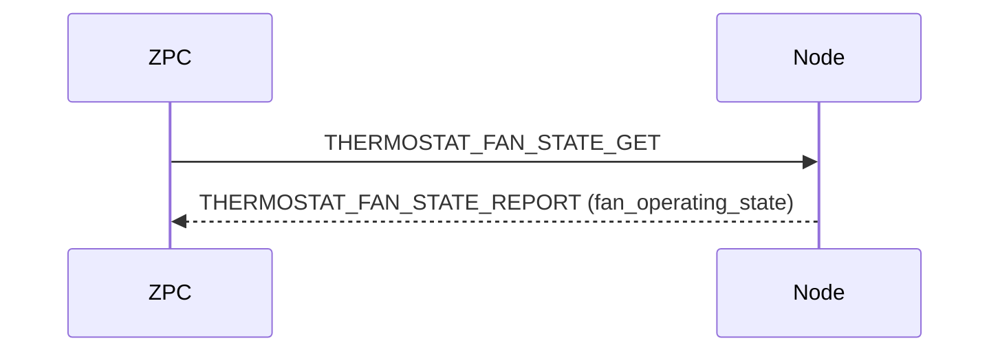
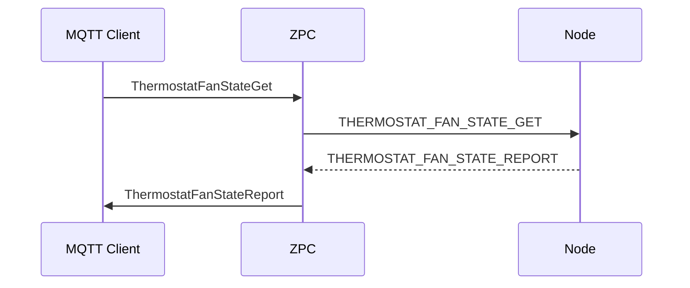

# Thermostat Fan State CC — Sequence Diagrams

## Interview Flow

```mermaid
sequenceDiagram
    participant ZPC
    participant Node

    ZPC->>Node: THERMOSTAT_FAN_STATE_GET
    Node-->>ZPC: THERMOSTAT_FAN_STATE_REPORT (fan_operating_state)
```

## Get Fan State Flow (via MQTT)

```mermaid
sequenceDiagram
    participant MQTT_Client as MQTT Client
    participant ZPC
    participant Node

    MQTT_Client->>ZPC: ThermostatFanStateGet
    ZPC->>Node: THERMOSTAT_FAN_STATE_GET
    Node-->>ZPC: THERMOSTAT_FAN_STATE_REPORT
    ZPC->>MQTT_Client: ThermostatFanStateReport
```
