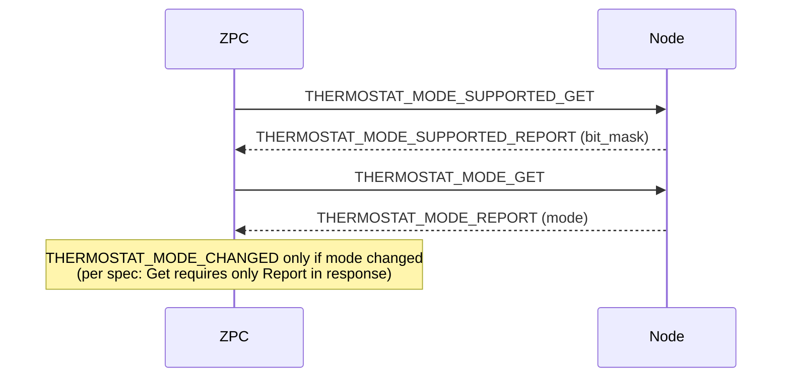
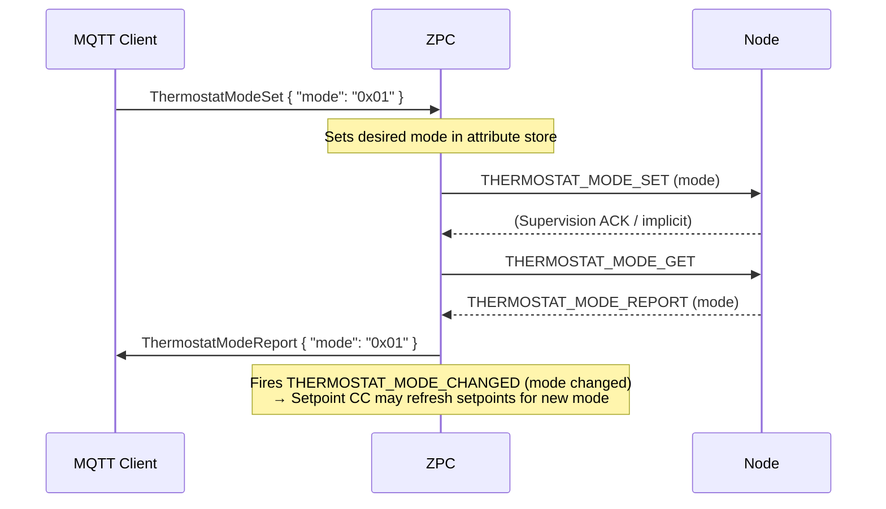
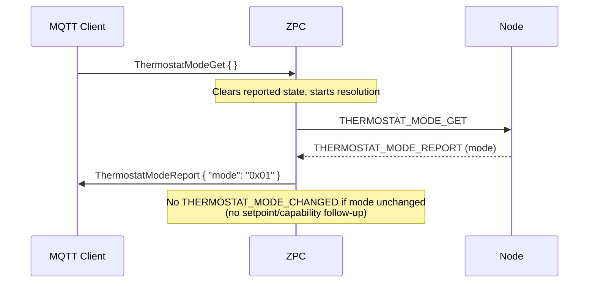
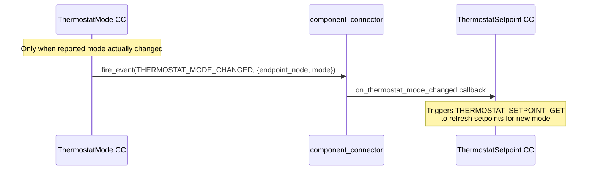

# Thermostat Mode CC — Sequence Diagrams

## Interview Flow

## Set Mode Flow (via MQTT)

## Get Mode Flow (via MQTT)

Per Z-Wave spec, Thermostat Mode Get requires only Thermostat Mode Report in response. No setpoint or capability chain.

## Inter-CC Communication

