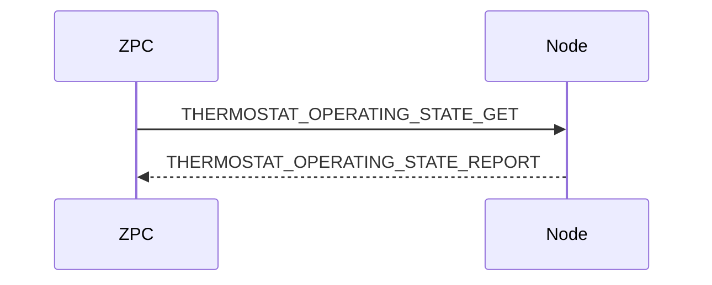
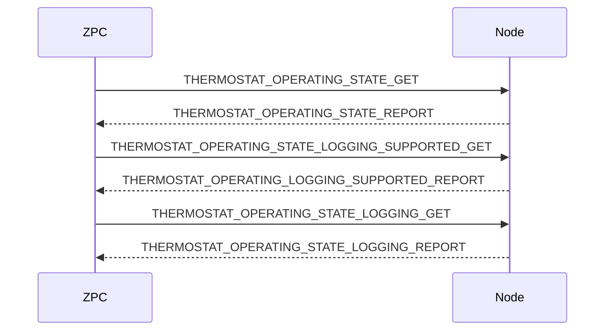
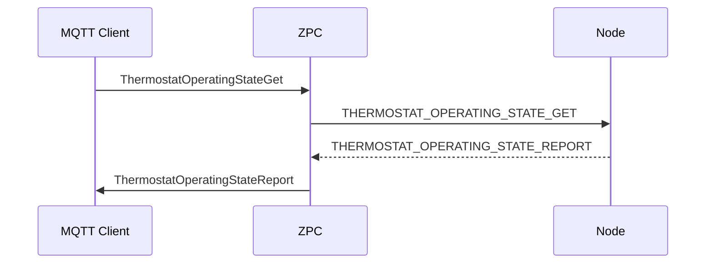

# Thermostat Operating State CC — Sequence Diagrams

## Interview Flow (version 1)

```mermaid
sequenceDiagram
    participant ZPC
    participant Node

    ZPC->>Node: THERMOSTAT_OPERATING_STATE_GET
    Node-->>ZPC: THERMOSTAT_OPERATING_STATE_REPORT
```

## Interview Flow (version 2)

```mermaid
sequenceDiagram
    participant ZPC
    participant Node

    ZPC->>Node: THERMOSTAT_OPERATING_STATE_GET
    Node-->>ZPC: THERMOSTAT_OPERATING_STATE_REPORT
    ZPC->>Node: THERMOSTAT_OPERATING_STATE_LOGGING_SUPPORTED_GET
    Node-->>ZPC: THERMOSTAT_OPERATING_LOGGING_SUPPORTED_REPORT
    ZPC->>Node: THERMOSTAT_OPERATING_STATE_LOGGING_GET
    Node-->>ZPC: THERMOSTAT_OPERATING_STATE_LOGGING_REPORT
```

## Get Operating State (via MQTT)

```mermaid
sequenceDiagram
    participant MQTT_Client as MQTT Client
    participant ZPC
    participant Node

    MQTT_Client->>ZPC: ThermostatOperatingStateGet
    ZPC->>Node: THERMOSTAT_OPERATING_STATE_GET
    Node-->>ZPC: THERMOSTAT_OPERATING_STATE_REPORT
    ZPC->>MQTT_Client: ThermostatOperatingStateReport
```
