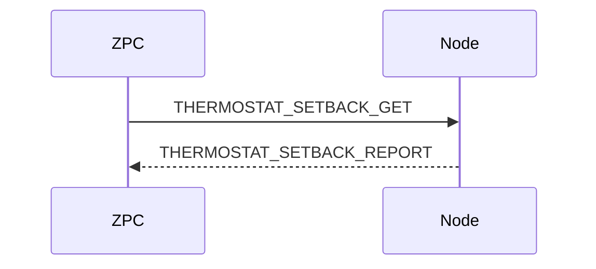
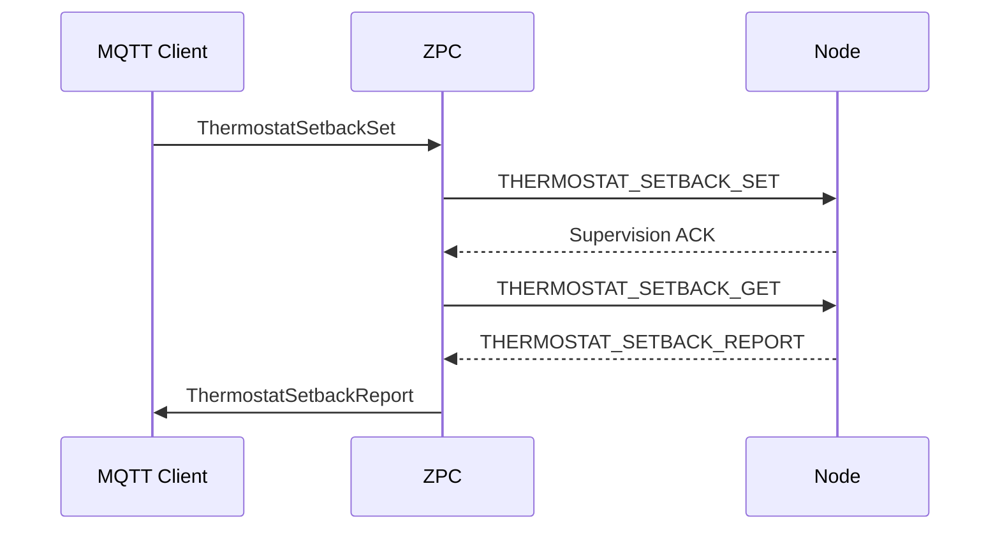
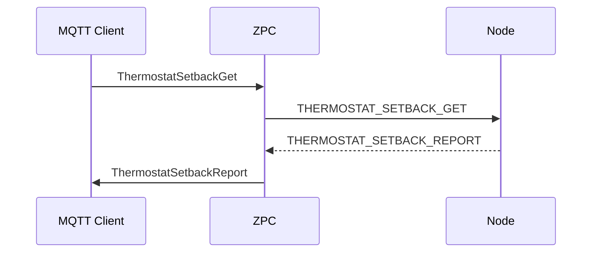

# Thermostat Setback CC — Sequence Diagrams

## Interview Flow

```mermaid
sequenceDiagram
    participant ZPC
    participant Node

    ZPC->>Node: THERMOSTAT_SETBACK_GET
    Node-->>ZPC: THERMOSTAT_SETBACK_REPORT
```

## Set Setback (via MQTT)

```mermaid
sequenceDiagram
    participant MQTT_Client as MQTT Client
    participant ZPC
    participant Node

    MQTT_Client->>ZPC: ThermostatSetbackSet
    ZPC->>Node: THERMOSTAT_SETBACK_SET
    Node-->>ZPC: Supervision ACK
    ZPC->>Node: THERMOSTAT_SETBACK_GET
    Node-->>ZPC: THERMOSTAT_SETBACK_REPORT
    ZPC->>MQTT_Client: ThermostatSetbackReport
```

## Get Setback (via MQTT)

```mermaid
sequenceDiagram
    participant MQTT_Client as MQTT Client
    participant ZPC
    participant Node

    MQTT_Client->>ZPC: ThermostatSetbackGet
    ZPC->>Node: THERMOSTAT_SETBACK_GET
    Node-->>ZPC: THERMOSTAT_SETBACK_REPORT
    ZPC->>MQTT_Client: ThermostatSetbackReport
```
