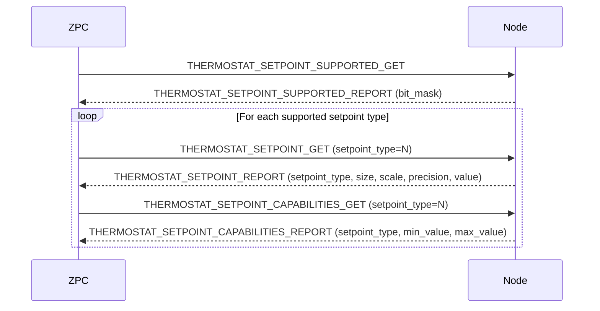
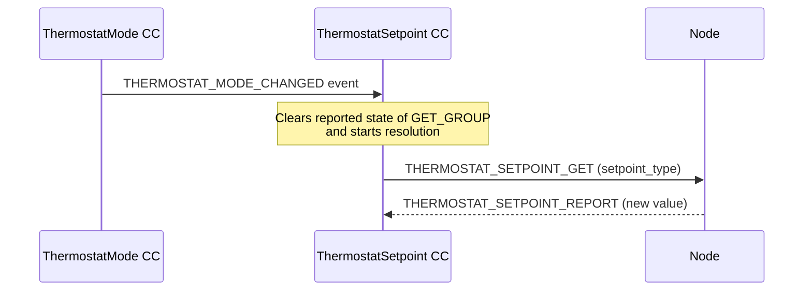
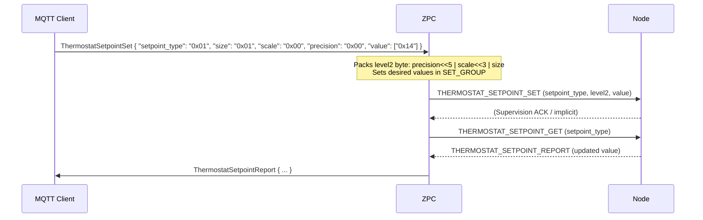
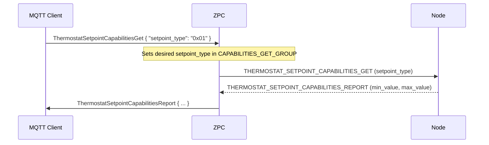

# Thermostat Setpoint CC — Sequence Diagrams

## Interview Flow

```mermaid
sequenceDiagram
    participant ZPC
    participant Node

    ZPC->>Node: THERMOSTAT_SETPOINT_SUPPORTED_GET
    Node-->>ZPC: THERMOSTAT_SETPOINT_SUPPORTED_REPORT (bit_mask)

    loop For each supported setpoint type
        ZPC->>Node: THERMOSTAT_SETPOINT_GET (setpoint_type=N)
        Node-->>ZPC: THERMOSTAT_SETPOINT_REPORT (setpoint_type, size, scale, precision, value)
        ZPC->>Node: THERMOSTAT_SETPOINT_CAPABILITIES_GET (setpoint_type=N)
        Node-->>ZPC: THERMOSTAT_SETPOINT_CAPABILITIES_REPORT (setpoint_type, min_value, max_value)
    end
```

## Mode Change Triggered Refresh

```mermaid
sequenceDiagram
    participant ThermostatMode CC
    participant ThermostatSetpoint CC
    participant Node

    ThermostatMode CC->>ThermostatSetpoint CC: THERMOSTAT_MODE_CHANGED event
    Note over ThermostatSetpoint CC: Clears reported state of GET_GROUP<br/>and starts resolution
    ThermostatSetpoint CC->>Node: THERMOSTAT_SETPOINT_GET (setpoint_type)
    Node-->>ThermostatSetpoint CC: THERMOSTAT_SETPOINT_REPORT (new value)
```

## Set Setpoint Flow (via MQTT)

```mermaid
sequenceDiagram
    participant MQTT Client
    participant ZPC
    participant Node

    MQTT Client->>ZPC: ThermostatSetpointSet { "setpoint_type": "0x01", "size": "0x01", "scale": "0x00", "precision": "0x00", "value": ["0x14"] }
    Note over ZPC: Packs level2 byte: precision<<5 | scale<<3 | size<br/>Sets desired values in SET_GROUP
    ZPC->>Node: THERMOSTAT_SETPOINT_SET (setpoint_type, level2, value)
    Node-->>ZPC: (Supervision ACK / implicit)
    ZPC->>Node: THERMOSTAT_SETPOINT_GET (setpoint_type)
    Node-->>ZPC: THERMOSTAT_SETPOINT_REPORT (updated value)
    ZPC->>MQTT Client: ThermostatSetpointReport { ... }
```

## Capabilities Query Flow (via MQTT)

```mermaid
sequenceDiagram
    participant MQTT Client
    participant ZPC
    participant Node

    MQTT Client->>ZPC: ThermostatSetpointCapabilitiesGet { "setpoint_type": "0x01" }
    Note over ZPC: Sets desired setpoint_type in CAPABILITIES_GET_GROUP
    ZPC->>Node: THERMOSTAT_SETPOINT_CAPABILITIES_GET (setpoint_type)
    Node-->>ZPC: THERMOSTAT_SETPOINT_CAPABILITIES_REPORT (min_value, max_value)
    ZPC->>MQTT Client: ThermostatSetpointCapabilitiesReport { ... }
```
