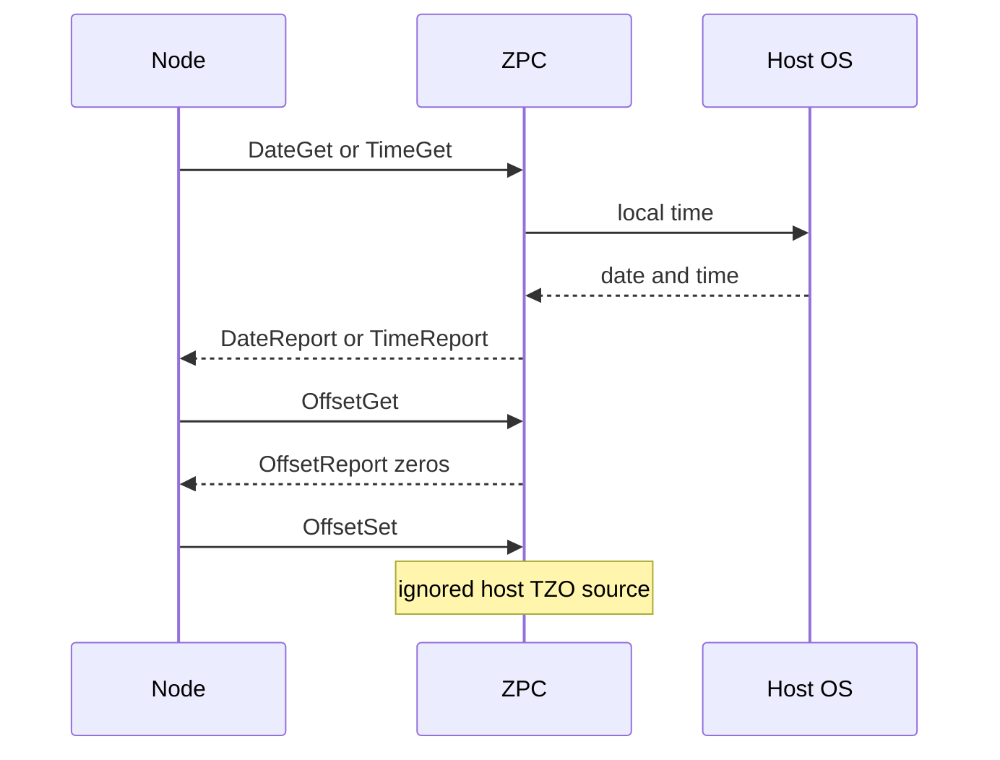

# Time Command Class (0x8A)

ZPC **supports** Time Command Class version 3 as a time server.

## Spec

Z-Wave Application Specification: Time Command Class, versions 1–3 (`CC:008A`).

Date and time in Get reports come from the host OS. Time Report Time Source is Wi-Fi/Internet (`CC:008A.03.02.11.004`). RTC Failure is 0 (`CC:008A.03.02.11.006`).

## Behaviour

| Command | Requirement | ZPC action |
|---------|-------------|------------|
| Date Get / Time Get / Offset Get | `CC:008A.03.00.41.003` accept at any class | Report host date/time; Offset Report zeros |
| Time Offset Set | `CC:008A.03.00.41.001` then `CC:008A.02.05.13.001` | Not highest: no support. Highest: ignore (host is TZO source) |
| Time Set | `CC:008A.03.00.41.001` then `CC:008A.03.02.11.005` | Not highest: no support. Highest: ignore (Time Source is Wi-Fi) |
| Date Set | `CC:008A.03.00.41.001` | Not highest: no support. Highest: not applied (host date; Supervision FAIL) |

`CC:008A.03.02.11.005` applies to Time Set and incoming Time Report, not Date Set.

## MQTT Interface

See [command_class_time_mqtt_interface.md](generated/command_class_time_mqtt_interface.md) for the MQTT API documentation.
