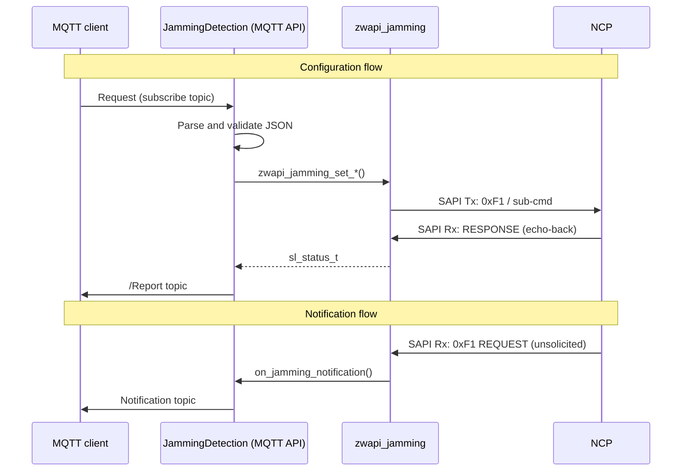

# Jamming Detection

## Overview

The `jamming_detection` component bridges NCP-level RF jamming detection to MQTT.

The NCP samples background RSSI per physical channel on a fixed 100 ms cadence. It maintains a rolling window of samples per channel and fires an unsolicited Serial API frame (FUNC_ID 0xF1) when a jamming condition is detected, cleared, or when a periodic re-report timer expires. ZPC translates those frames into MQTT notifications and exposes configuration commands.

Configuration is held in NCP RAM and is lost on NCP reset.

## Architecture



## MQTT API

All topics are relative to `zpc/<home_id>`.

### Configuration/Channel

Configure jamming detection threshold and trigger for one channel.

**Subscribe:** `Network/JammingDetection/Configuration/Channel`

```json
{
  "channel": 3,
  "threshold_dbm": "-50",
  "nb_samples": 95
}
```

| Field | Type | Range | Description |
|---|---|---|---|
| `channel` | Integer | 0–4 | Channel index |
| `threshold_dbm` | String | "-128"–"0" | RSSI threshold in dBm |
| `nb_samples` | Integer | 1–150 | Samples above threshold to trigger jamming |

**Publish:** `Network/JammingDetection/Configuration/Channel/Report`

On success the report includes the values echoed by the NCP:

```json
{
  "status": "ok",
  "channel": 3,
  "threshold_dbm": "-50",
  "nb_samples": 95
}
```

On failure only `status` is present (`"fail"`, `"invalid_channel"`, `"invalid_threshold_dbm"`, or `"invalid_nb_samples"`).

### Configuration/JammingReportPeriod

Set the re-report interval while a jamming condition persists.

**Subscribe:** `Network/JammingDetection/Configuration/JammingReportPeriod`

```json
{"period_secs": 5}
```

| Field | Type | Range | Description |
|---|---|---|---|
| `period_secs` | Integer | 0–20 | Re-report period. 0 disables periodic re-reporting. |

**Publish:** `Network/JammingDetection/Configuration/JammingReportPeriod/Report`

On success the report includes the period echoed by the NCP:

```json
{
  "status": "ok",
  "period_secs": 5
}
```

On failure only `status` is present (`"fail"` or `"invalid_period_secs"`).

### Configuration/RssiCollection

Start or stop periodic RSSI collection.

**Subscribe:** `Network/JammingDetection/Configuration/RssiCollection`

```json
{"period_100ms": 100}
```

| Field | Type | Range | Description |
|---|---|---|---|
| `period_100ms` | Integer | 0–65535 | 0 stops collection; 65535 (0xFFFF) is continuous. |

**Publish:** `Network/JammingDetection/Configuration/RssiCollection/Report`

On success the report includes the period count echoed by the NCP:

```json
{
  "status": "ok",
  "period_100ms": 100
}
```

On failure only `status` is present (`"fail"` or `"invalid_period_100ms"`).

### Status response values

| Value | Meaning |
|---|---|
| `"ok"` | NCP accepted and echoed the configuration. Report includes the echoed fields. |
| `"invalid_channel"` | `channel` missing, wrong type, or out of range (0–4). |
| `"invalid_threshold_dbm"` | `threshold_dbm` missing, wrong type, or out of range ("-128"–"0"). |
| `"invalid_nb_samples"` | `nb_samples` missing, wrong type, or out of range (1–150). |
| `"invalid_period_secs"` | `period_secs` missing, wrong type, or out of range (0–20). |
| `"invalid_period_100ms"` | `period_100ms` missing, wrong type, or out of range (0–65535). |
| `"fail"` | NCP did not respond or returned an error. |

### Notification/Jamming

Published when the NCP detects a change in jamming state or re-reports while jamming persists.

**Publish:** `Network/JammingDetection/Notification/Jamming`

```json
{
  "channels": [
    {
      "channel": 0,
      "jammed": true,
      "threshold_dbm": "-50",
      "nb_samples_trigger_notification": 95,
      "samples_above_threshold": 101
    },
    {"channel": 1, "jammed": false, "threshold_dbm": "-50", "nb_samples_trigger_notification": 95, "samples_above_threshold": 0},
    {"channel": 2, "jammed": false, "threshold_dbm": "-50", "nb_samples_trigger_notification": 95, "samples_above_threshold": 0},
    {"channel": 3, "jammed": false, "threshold_dbm": "-50", "nb_samples_trigger_notification": 95, "samples_above_threshold": 0},
    {"channel": 4, "jammed": false, "threshold_dbm": "0",   "nb_samples_trigger_notification": 0,  "samples_above_threshold": 0}
  ]
}
```

### Notification/RssiCollection

Published for each 100 ms collection period while RSSI collection is active.

**Publish:** `Network/JammingDetection/Notification/RssiCollection`

```json
{
  "channels": [
    {"channel": 0, "rssi_dbm": "-102"},
    {"channel": 1, "rssi_dbm": "-103"},
    {"channel": 2, "rssi_dbm": "-103"},
    {"channel": 3, "rssi_dbm": "-97"},
    {"channel": 4, "rssi_dbm": "-128"}
  ]
}
```

`rssi_dbm` of `"-128"` indicates an invalid or unavailable RSSI reading for that channel.

## Serial API (FUNC_ID 0xF1)

| Sub-command | Direction | Description |
|---|---|---|
| `0x00` | NCP → ZPC (unsolicited) | Jamming state report |
| `0x01` | Bidirectional | RSSI collection: write starts collection; unsolicited reads deliver snapshots |
| `0x02` | ZPC → NCP | Per-channel configuration |
| `0x03` | ZPC → NCP | Report period configuration |

See the [ADT SerialAPI Commands specification](https://confluence.silabs.com/spaces/ZWAVE/pages/785944433/Jamming+Detection+Serial+API) for full frame layouts.

## Implementation notes

- The NCP callback runs in the `zwave_rx` polling thread. `publish_report` is thread-safe.
- Configuration commands block the calling MQTT thread while waiting for the NCP RESPONSE frame.
- No attribute store state is maintained: all data flows directly between MQTT and the NCP.
