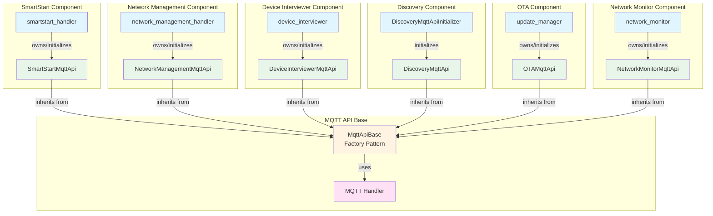
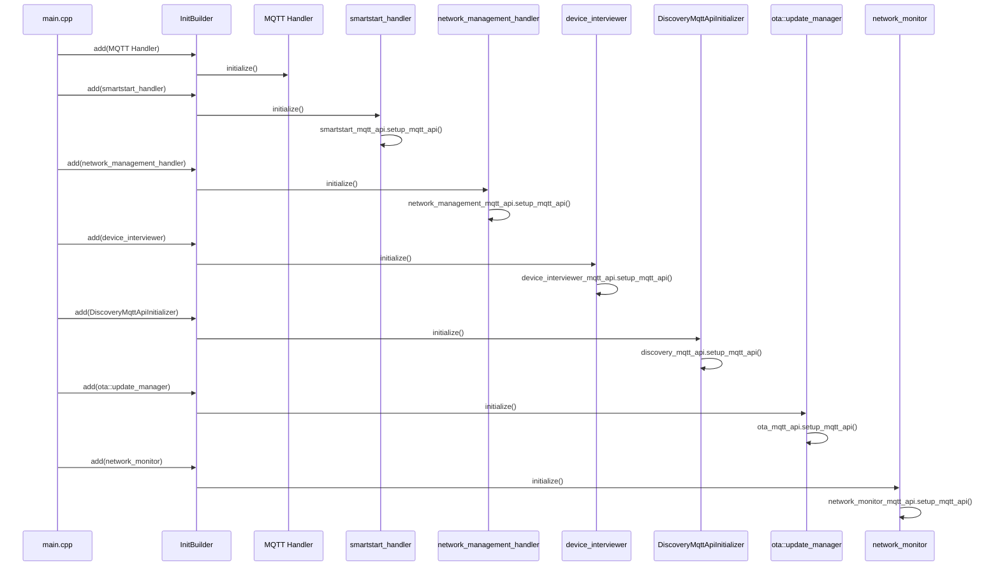
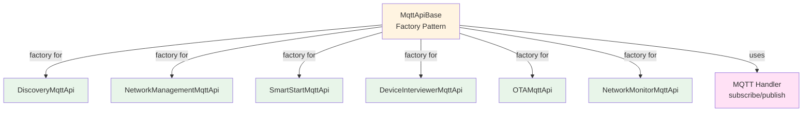
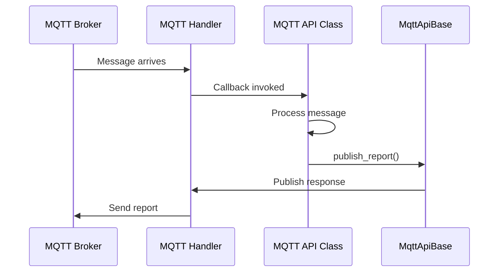

# MQTT API Implementation Guide

## Table of Contents
- [Architecture Overview](#architecture-overview)
- [Initialization Locations](#initialization-locations)
- [MqttApiBase - Factory Pattern](#mqttapibase-factory-pattern)
- [Creating MQTT API Classes](#creating-mqtt-api-classes)

## Architecture Overview

The MQTT API component uses a **distributed initialization pattern** where each MQTT API class is initialized in its respective component location:

1. **`SmartStartMqttApi`** - Initialized in `smartstart_handler::initialize()`
2. **`NetworkManagementMqttApi`** - Initialized in `network_management_handler::initialize()`
3. **`DeviceInterviewerMqttApi`** - Initialized in `device_interviewer::initialize()`
4. **`DiscoveryMqttApi`** - Initialized via `DiscoveryMqttApiInitializer` in `main.cpp`
5. **`OTAMqttApi`** - Initialized in `update_manager::initialize()` (OTA component)
6. **`NetworkMonitorMqttApi`** - Initialized in `network_monitor::initialize()` and publishes unsolicited `Network/Status/Report`
7. **`MqttApiBase`** - Uses the **Factory Pattern** to provide a framework for creating MQTT API classes

This approach improves cohesion by keeping MQTT API initialization close to the components that use them.

### Architecture Diagram



## Initialization Locations

### SmartStartMqttApi

**Location:** `components/smartstart/include/smartstart.hpp` and `components/smartstart/src/smartstart.cpp`

The `SmartStartMqttApi` is initialized as part of the `smartstart_handler` class:

```cpp
class smartstart_handler : public threading::threading, public Initializable {
private:
    zwave_command_class::SmartStartMqttApi smartstart_mqtt_api_instance;
    // ...
};

sl_status_t smartstart_handler::initialize() {
    // ... other initialization ...
    smartstart_mqtt_api_instance.setup_mqtt_api();
    return SL_STATUS_OK;
}
```

**Initialization Order:** The `smartstart_handler` is initialized in `main.cpp` after the MQTT handler is ready, ensuring the MQTT API can subscribe to topics.

### NetworkManagementMqttApi

**Location:** `components/network_manager/include/network_management_handler.hpp` and `components/network_manager/src/zpc_network_management.cpp`

The `NetworkManagementMqttApi` is initialized as part of the `network_management_handler` class:

```cpp
class network_management_handler : public threading::threading, public Initializable {
private:
    zwave_command_class::NetworkManagementMqttApi network_management_mqtt_api_instance;
    // ...
};

sl_status_t network_management_handler::initialize() {
    network_management_mqtt_api_instance.setup_mqtt_api();
    return SL_STATUS_OK;
}
```

**Initialization Order:** The `network_management_handler` is initialized in `main.cpp` after the MQTT handler is ready.

### DeviceInterviewerMqttApi

**Location:** `components/device_interviewer/inc/device_interviewer.hpp` and `components/device_interviewer/src/device_interviewer.cpp`

The `DeviceInterviewerMqttApi` is initialized as part of the `device_interviewer` class:

```cpp
class device_interviewer : public threading::threading, public Initializable {
private:
    zwave_command_class::DeviceInterviewerMqttApi device_interviewer_mqtt_api;
    // ...
};

sl_status_t device_interviewer::initialize() {
    // ... other initialization ...
    device_interviewer_mqtt_api.setup_mqtt_api();
    return SL_STATUS_OK;
}
```

**Initialization Order:** The `device_interviewer` is initialized in `main.cpp` after the MQTT handler is ready. It publishes to `Interview/Report` when a device interview terminates (per node and per endpoint), including a `status` field for the interview result.

### DiscoveryMqttApi

**Location:** `components/discovery/include/discovery_mqtt_api_initializer.hpp` and `components/discovery/src/discovery_mqtt_api_initializer.cpp`

The `DiscoveryMqttApi` is initialized via a standalone `DiscoveryMqttApiInitializer` class:

```cpp
class DiscoveryMqttApiInitializer : public Initializable {
private:
    static DiscoveryMqttApi discovery_mqtt_api_instance;
    // ...
};

sl_status_t DiscoveryMqttApiInitializer::initialize() {
    discovery_mqtt_api_instance.setup_mqtt_api();
    return SL_STATUS_OK;
}
```

**Initialization Order:** The `DiscoveryMqttApiInitializer` is added to `main.cpp` after the MQTT handler is initialized.

### OTAMqttApi

**Location:** `components/ota/include/ota_mqtt_api.hpp` and `components/ota/src/ota_mqtt_api.cpp`

The `OTAMqttApi` is owned by the OTA `update_manager` component, which runs its own worker thread and state machine. Commands that need state-machine handling (`StartFirmwareUpload`, `Abort`, `Activate`, `Progress`) enqueue `ota_external_event_data` on the worker queue; `UploadImage`, `ListImages`, and `RemoveImage` are handled synchronously by the API. See [OTA Firmware Manager](../../ota/docs/ota.md) for the full state machine and MQTT topic list.

### NetworkMonitorMqttApi

**Location:** `components/network_monitor/`

The `NetworkMonitorMqttApi` is initialized as part of the `network_monitor` component. It publishes **unsolicited** `Network/Status/Report` messages that reflect node availability transitions (online / offline / unknown) for Always-Listening, FLiRS, and Non-Listening devices. See [Network Status](../../network_monitor/doc/network_status.md) for the payload and lifecycle details.

### Initialization Flow



## MqttApiBase - Factory Pattern

The `MqttApiBase` uses the **Factory Pattern** to provide a framework for creating MQTT API classes. All specialized API classes inherit from this base class, which acts as a factory that provides the common infrastructure needed to create functional MQTT API implementations.

### Architecture



### How It Works

The `MqttApiBase` acts as a factory that:
- Provides the common infrastructure (subscribe, publish, topic formatting) needed to create MQTT API classes
- Defines the interface (`setup_mqtt_api()`) that all MQTT API classes must implement
- Supplies protected helper methods (`subscribe_topic()`, `publish_report()`, `get_base_topic()`) for common MQTT operations
- Handles automatic base topic prefixing (`zpc/{home_id}/`)
- Encapsulates interaction with the MQTT Handler

### Topic Handling Flow



## Creating MQTT API Classes

To create a new MQTT API class, inherit from `MqttApiBase` and implement the `setup_mqtt_api()` method. Then initialize it in the appropriate component location.

### Header Structure

```cpp
class MyFeatureMqttApi : public MqttApiBase {
public:
    void setup_mqtt_api() override;
private:
    inline static std::string MQTT_API_MY_FEATURE_TOPIC = "MyFeature/Command";
    void on_my_feature_command(const std::string &topic, const std::string &message);
};
```

### Implementation Pattern

```cpp
void MyFeatureMqttApi::setup_mqtt_api() {
    subscribe_topic(MQTT_API_MY_FEATURE_TOPIC, [this](auto& topic, auto& message) {
        this->on_my_feature_command(topic, message);
    });
}

void MyFeatureMqttApi::on_my_feature_command(const std::string &topic, const std::string &message) {
    // Process command
    publish_report("MyFeature/Report", response_json, false);
}
```

**Key Points:**
- Inherit from `MqttApiBase` to get common MQTT functionality
- Implement `setup_mqtt_api()` to set up topic subscriptions
- Use `subscribe_topic()` and `publish_report()` for MQTT operations
- Base topic (`zpc/{home_id}/`) is automatically prepended unless `add_base_topic=false`
- Initialize the API instance in the appropriate component handler or create a standalone initializer

**Reference Implementation:** See `components/discovery/include/discovery_mqtt_api.hpp` and `components/discovery/src/discovery_mqtt_api.cpp` for a complete example.

For detailed API reference, see [MQTT API Interface Documentation](mqtt_api_interface.md).
