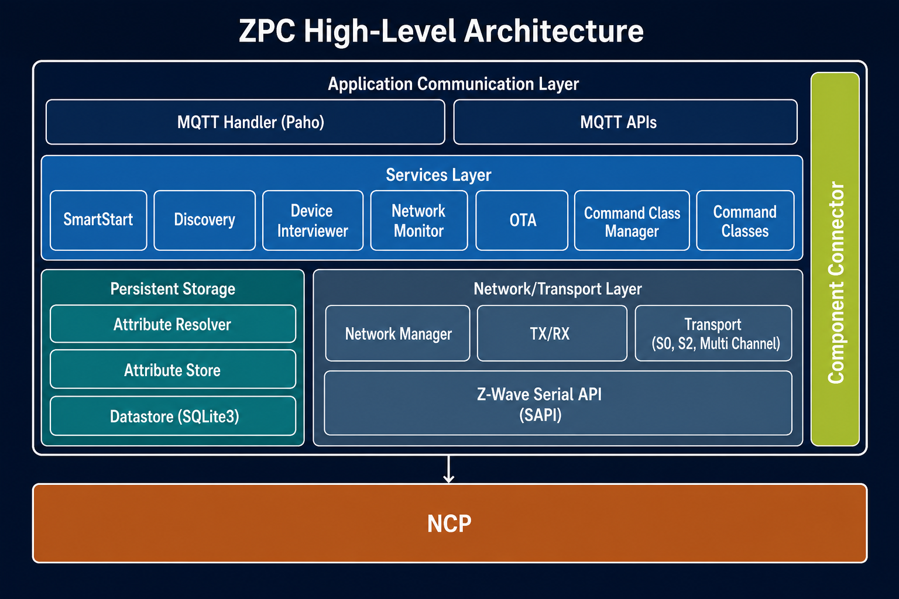

# ZPC High-Level Architecture

## Blocks

**Component Connector** — Makes components interact with each other.

**MQTT APIs** — Redirects MQTT messages to the appropriate services.

**MQTT Handler (Paho)** — Handles MQTT communication.

**Command Classes** — Concrete implementations of Z-Wave application command classes.

**Command Class Manager** — Maintains the registry of all supported and controlled command classes, validates that incoming frames arrive at the required security level, and dispatches them to the correct command classhandler.

**OTA (Over-The-Air)** — Over-the-air firmware update service.

**Network Monitor** — Tracks nodes status and detects failing nodes.

**Device Interviewer** — Interviews a newly included node to collect its full capabilities.

**Discovery** — Discovery service to detect ZPC instances in the network.

**SmartStart** — SmartStart service.

**Datastore (SQLite3)** — Serializes the Attribute Store database to a versioned SQLite3 database on disk.

**Attribute Resolver** — Watches the Attribute Store for attributes whose reported and desired values diverge and then tries to resolve them.

**Attribute Store** — Tree-structured hierarchical database to store Z-Wave device attributes.

**Network Manager** — Manages Z-Wave network operations like node inclusion/exclusion, S2 bootstrapping, factory reset, etc.

**TX/RX** — Transmits/receives Z-Wave frames.

**Transport (S0, S2, Multi Channel)** — Encapsulates/decapsulates Z-Wave frames.

**Z-Wave Serial API (SAPI)** — Serial API protocol to talk to the NCP over a serial connection.

**NCP** — External Z-Wave radio module.
