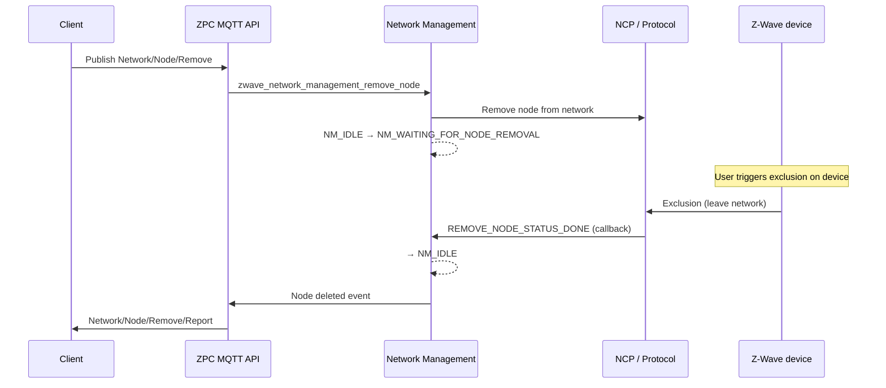

# Exclusion Flow

This document describes the sequence for removing a node from the Z-Wave network (exclusion). It covers MQTT topics and the Network Management state machine.

## Overview

1. **Client** publishes to `zpc/<home_id>/Network/Node/Remove` to start exclusion.
2. **ZPC** enters remove mode and instructs the NCP to listen for a node leaving the network.
3. The user puts the **device** into exclusion mode (device-specific; e.g. button press).
4. When the device is removed, the NCP notifies ZPC; ZPC publishes `Network/Node/Remove/Report` and returns to idle.

## Step-by-step (client / user)

Follow these steps to remove an end device from the network:

| Step | Action | Details |
|------|--------|---------|
| **1** | Wait for ZPC to be running | Ensure ZPC is started and connected to the MQTT broker and NCP. |
| **2** | Fetch home ID from ZPC | Publish to `zpc/Discovery` with payload `{}`. Subscribe to `zpc/Discovery/Report` and read the `home_id` from the response. |
| **3** | Send Remove Node request to ZPC | Publish to `zpc/<home_id>/Network/Node/Remove` with payload `{}`. ZPC enters remove mode and waits for a node to leave the network. |
| **4** | Put end device into exclusion mode | On the end device, trigger exclusion/learn mode (e.g. push BTN1 or follow the device manual). The device will leave the network. |
| **5** | Wait for Remove/Report and print result | Subscribe to `zpc/<home_id>/Network/Node/Remove/Report`. When the node is removed, ZPC publishes `{"node_id": <id>}`. Use this to confirm which node was excluded. |

## MQTT topics involved

| Step | Topic | Direction |
|------|--------|-----------|
| Start exclusion | `zpc/<home_id>/Network/Node/Remove` | Client → ZPC |
| Abort exclusion | `zpc/<home_id>/Network/Node/Remove/Abort` | Client → ZPC |
| Node removed | `zpc/<home_id>/Network/Node/Remove/Report` | ZPC → Client |

**Payload for Remove:** `{}` (empty JSON).  
**Report payload:** `{"node_id": <id>}`.

## Sequence diagram

## Network Management states (exclusion)

The Network Management state machine uses the following state during exclusion:

| State | Description |
|-------|-------------|
| `NM_IDLE` | No operation in progress |
| `NM_WAITING_FOR_NODE_REMOVAL` | Remove mode started; waiting for protocol to report node removed (or timeout/failure) |
| (back to) `NM_IDLE` | Exclusion complete or failed |

The protocol reports status via callbacks (e.g. `REMOVE_NODE_STATUS_LEARN_READY`, `REMOVE_NODE_STATUS_NODE_FOUND`, `REMOVE_NODE_STATUS_REMOVING_END_NODE` / `REMOVING_CONTROLLER`, `REMOVE_NODE_STATUS_DONE`, `REMOVE_NODE_STATUS_FAILED`). On `REMOVE_NODE_STATUS_DONE`, ZPC publishes `Network/Node/Remove/Report` with the removed node ID and returns to `NM_IDLE`. On timeout or `REMOVE_NODE_STATUS_FAILED`, ZPC returns to `NM_IDLE` without a report (or with error handling as implemented).

## Removing a failing (non-responsive) node

The exclusion flow described above requires the device to actively participate. If a node is unreachable or non-functional (e.g. powered off, damaged, or out of range), use the **Remove Failed Node** topic instead:

1. Publish to `zpc/<home_id>/Network/Node/RemoveFailed` with payload `{"node_id": <id>}`.
2. Subscribe to `zpc/<home_id>/Network/Node/RemoveFailed/Report` for the result.
3. If the result is `"ok"`, also expect a `Network/Node/Remove/Report` with the node ID and DSK (same report as a normal exclusion).

The controller first sends a NOP to verify the node is truly unreachable:

- **Node not reachable:** The controller removes the node and reports `{"node_id": <id>, "status": "ok", "reason": "operation_successful"}` on `RemoveFailed/Report`. A `Network/Node/Remove/Report` with the node's DSK is also published.
- **Node reachable:** The node is not considered failed, so the controller does **not** remove it and reports `{"node_id": <id>, "status": "fail", "reason": "node_online"}` on `RemoveFailed/Report`. Use the normal exclusion flow (`Network/Node/Remove`) instead.

See [NETWORK_NODE_REMOVE_FAILED](../../components/network_manager/doc/network_management_mqtt_api.md#network_node_remove_failed) for full payload details.

## See also

- [Network Management MQTT API](../../components/network_manager/doc/network_management_mqtt_api.md) — All network topics and payloads
- [MQTT API index](../../components/mqtt_api/doc/mqtt_api_index.md) — Central MQTT API list
- [Inclusion flow](inclusion_flow.md) — Add node sequence
