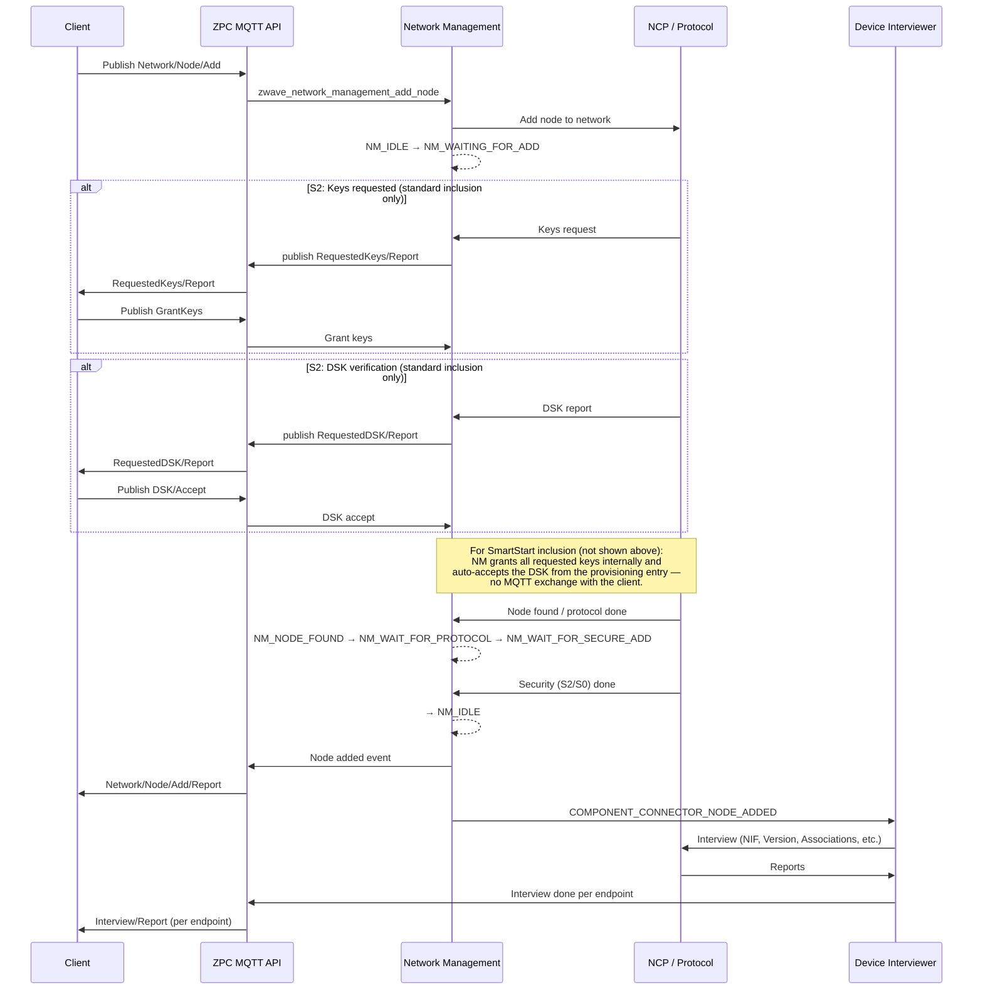

# Inclusion Flow

This document describes the sequence from starting a Z-Wave inclusion to having a node added and fully interviewed. It covers MQTT topics, the Network Management state machine, and the device interview.

## Overview

1. **Client** starts inclusion via MQTT (`Network/Node/Add` or SmartStart `Network/SmartStart/Update`).
2. **ZPC** enters add mode and waits for the protocol (NCP) to detect a node.
3. For **standard S2 inclusion**, ZPC may publish `RequestedKeys/Report` and/or `RequestedDSK/Report`; the client responds with `GrantKeys` and/or `DSK/Accept`. SmartStart inclusion does not use these topics — ZPC grants all requested keys and auto-verifies the DSK against the provisioning entry internally.
4. When the node is included, ZPC publishes `Network/Node/Add/Report` (`status: success`) and the **Device Interviewer** runs automatically. On security bootstrapping failure, ZPC publishes `Add/Report` with `status: fail` and `reason: 6404` (and a DSK when available); interview is **not** started. For SmartStart, that DSK stays provisioned so a later NIF can retry.
5. When each endpoint interview completes, ZPC publishes `Interview/Report`.

## Step-by-step (client / user)

Follow these steps to include an S2-capable end device (e.g. Switch On/Off) with key grant and DSK verification:

| Step | Action | Details |
|------|--------|---------|
| **1** | Wait for ZPC to be running | Ensure ZPC is started and connected to the MQTT broker and NCP. |
| **2** | Fetch home ID from ZPC | Publish to `zpc/Discovery` with payload `{}`. Subscribe to `zpc/Discovery/Report` and read the `home_id` from the response. |
| **3** | Send Add Node request to ZPC | Publish to `zpc/<home_id>/Network/Node/Add` with payload `{}`. ZPC enters add mode. |
| **4** | Push BTN1 on end device (learn mode) | Put the end device into inclusion/learn mode (e.g. push BTN1 per device manual). The device will try to join the network. |
| **5** | Wait for RequestedKeys/Report | Subscribe to `zpc/<home_id>/Network/RequestedKeys/Report`. When ZPC receives a key request from the node, it publishes the requested keys (and CSA flag) here. |
| **6** | Grant keys to ZPC | Publish to `zpc/<home_id>/Network/GrantKeys` with payload e.g. `{"Accept": true, "Keys": <keys>, "CSA": <csa>}` using the keys value (and optional CSA flag) from the RequestedKeys report. |
| **7** | Wait for RequestedDSK/Report | Subscribe to `zpc/<home_id>/Network/RequestedDSK/Report`. When DSK verification is needed, ZPC publishes the DSK string here. |
| **8** | Send DSK Accept to ZPC | Publish to `zpc/<home_id>/Network/DSK/Accept` with payload `{"dsk": "<first_5_digits_or_full_DSK>"}` (e.g. first 5 digits from the device or full DSK from the report). |
| **9** | Wait for Add/Report | Subscribe to `zpc/<home_id>/Network/Node/Add/Report`. On success ZPC publishes `{"node_id": <id>, "dsk": "...", "status": "success"}`. On security failure: `{"status": "fail", "reason": 6404, "dsk": "...", "node_id": <id>}`. |
| **10** | Wait for Interview/Report and print result | Subscribe to `zpc/<home_id>/Interview/Report`. ZPC publishes one report per endpoint when the interview finishes: `{"node_id": <id>, "endpoint_id": <ep>, "status": <code>}`. Use this to know when the device is fully interviewed (e.g. status 0 = success). |

## MQTT topics involved

| Step | Topic | Direction |
|------|--------|-----------|
| Start inclusion | `zpc/<home_id>/Network/Node/Add` | Client → ZPC |
| Abort inclusion | `zpc/<home_id>/Network/Node/Add/Abort` | Client → ZPC |
| (S2) Keys requested | `zpc/<home_id>/Network/RequestedKeys/Report` | ZPC → Client |
| (S2) Grant keys | `zpc/<home_id>/Network/GrantKeys` | Client → ZPC |
| (S2) DSK requested | `zpc/<home_id>/Network/RequestedDSK/Report` | ZPC → Client |
| (S2) Accept DSK | `zpc/<home_id>/Network/DSK/Accept` | Client → ZPC |
| Node added | `zpc/<home_id>/Network/Node/Add/Report` | ZPC → Client |
| Interview done (per endpoint) | `zpc/<home_id>/Interview/Report` | ZPC → Client |

SmartStart: the client may first publish the full provisioning list via `zpc/<home_id>/Network/SmartStart/Update` (each publish replaces the previous list); when a provisioned node powers up, ZPC starts inclusion automatically. S2 key grant and DSK verification are handled internally by ZPC — every S2 key requested by the node is granted, and the DSK is auto-verified against the provisioning entry. The `RequestedKeys/Report`, `GrantKeys`, `RequestedDSK/Report`, and `DSK/Accept` steps (5–8 above) are skipped for SmartStart inclusion.

## Sequence diagram

## Network Management states (inclusion)

The Network Management state machine (see `components/zwave/zwave_definitions/include/zwave_network_management_types.h` and `components/zwave/zwave_network_management/src/nm_state_machine.c`) moves through these states during a typical inclusion:

| State | Description |
|-------|-------------|
| `NM_IDLE` | No operation in progress |
| `NM_WAITING_FOR_ADD` | Add mode started; waiting for protocol to detect a node |
| `NM_NODE_FOUND` | Node detected; waiting for protocol to assign NodeID/HomeID |
| `NM_WAIT_FOR_PROTOCOL` | Waiting for protocol to finish adding the node |
| `NM_WAIT_FOR_SECURE_ADD` | Node added by protocol; S0 or S2 bootstrapping in progress |
| (back to) `NM_IDLE` | Inclusion complete (or failed/timeout) |

After the node is added, the **Device Interviewer** is triggered by the node-added event. Interview steps (NIF, Version, Z-Wave Plus Info, Wake Up, Associations, lifeline, multi-channel endpoints, etc.) are described in [Device Interviewer](../../components/device_interviewer/docs/device_interviewer.md).

## See also

- [Network Management MQTT API](../../components/network_manager/doc/network_management_mqtt_api.md) — All network topics and payloads
- [SmartStart MQTT API](../../components/mqtt_api/doc/smartstart_mqtt_api.md) — SmartStart topic
- [MQTT API index](../../components/mqtt_api/doc/mqtt_api_index.md) — Central MQTT API list
- [Exclusion flow](exclusion_flow.md) — Remove node sequence
